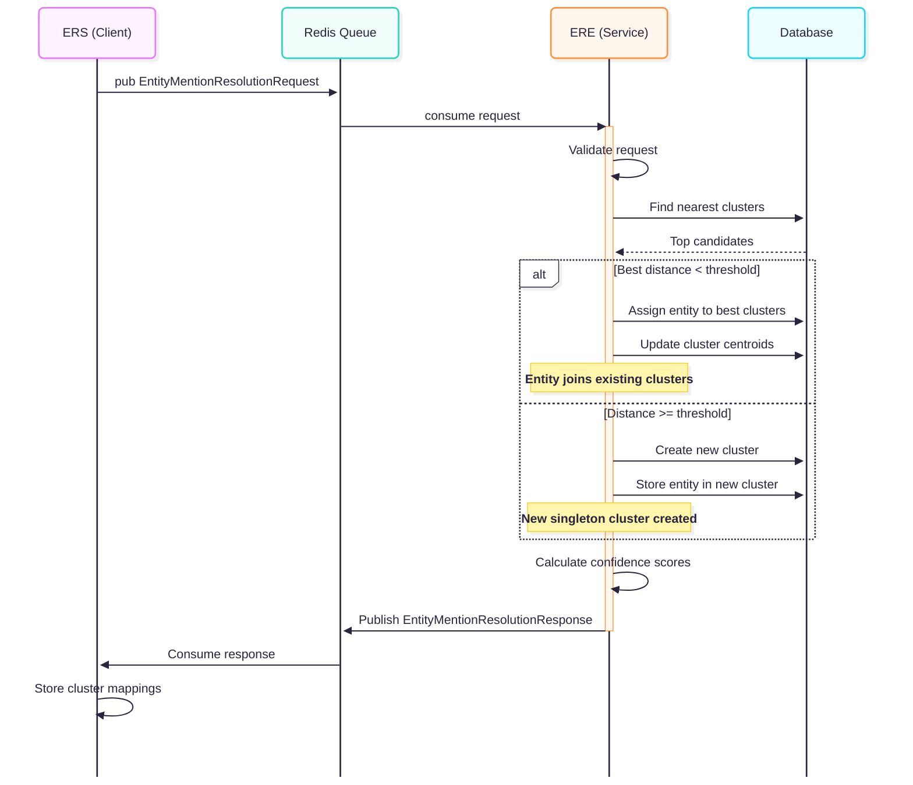

# Sequence diagrams for ERE interaction use cases.

In the diagrams below, the processing done by the ERE is non-prescriptive for the contract document, it only shows examples of how the ERE may operate.

## Regular resolution

*Diagrams made with [Mermaid chart](http://www.mermaidchart.com).*