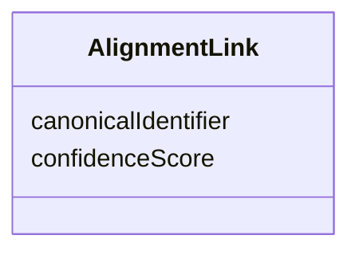

# Class: AlignmentLink 


_An alignment link representing a possible equivalence between an entity mention in the_

_`AlignmentLinkSet` the link belongs to, and a canonical entity, together with a confidence score._

__

_A semi-formal representation:_

__

_```_

_  for each (canonicalIdentifier, cconfidenceScore) in AlignmentLinkSet.alignmentOptions:_

_    entity(subjectEntityMentionIdentifier)  ==  entity(mentionIdentifier) _

_      with score = confidenceScore_

_```_

__


URI: [ers:AlignmentLink](https://data.europa.eu/ers/schema/AlignmentLink)





<!-- no inheritance hierarchy -->


## Slots

| Name | Cardinality and Range | Description | Inheritance |
| ---  | --- | --- | --- |
| [canonicalIdentifier](canonicalIdentifier.md) | 1 <br/> [Uri](Uri.md) | The identifier of the cluster/canonical entity that is considered equivalent ... | direct |
| [confidenceScore](confidenceScore.md) | 1 <br/> [Float](Float.md) | A 0-1 value of how confident the ERE is about the equivalence between the sub... | direct |


## Usages

| used by | used in | type | used |
| ---  | --- | --- | --- |
| [AlignmentLinkSet](AlignmentLinkSet.md) | [alignmentOptions](alignmentOptions.md) | range | [AlignmentLink](AlignmentLink.md) |


## Identifier and Mapping Information


### Schema Source


* from schema: https://data.europa.eu/ers/schema


## Mappings

| Mapping Type | Mapped Value |
| ---  | ---  |
| self | ers:AlignmentLink |
| native | ers:AlignmentLink |


## LinkML Source

<!-- TODO: investigate https://stackoverflow.com/questions/37606292/how-to-create-tabbed-code-blocks-in-mkdocs-or-sphinx -->

### Direct

<details>
```yaml
name: AlignmentLink
description: "An alignment link representing a possible equivalence between an entity\
  \ mention in the\n`AlignmentLinkSet` the link belongs to, and a canonical entity,\
  \ together with a confidence score.\n\nA semi-formal representation:\n\n```\n  for\
  \ each (canonicalIdentifier, cconfidenceScore) in AlignmentLinkSet.alignmentOptions:\n\
  \    entity(subjectEntityMentionIdentifier)  ==  entity(mentionIdentifier) \n  \
  \    with score = confidenceScore\n```\n"
from_schema: https://data.europa.eu/ers/schema
attributes:
  canonicalIdentifier:
    name: canonicalIdentifier
    description: 'The identifier of the cluster/canonical entity that is considered
      equivalent to the

      subject entity mention in the `AlignmentLinkSet` the link belongs to.

      '
    from_schema: https://data.europa.eu/ers/schema
    rank: 1000
    domain_of:
    - AlignmentLink
    range: uri
    required: true
  confidenceScore:
    name: confidenceScore
    description: 'A 0-1 value of how confident the ERE is about the equivalence between
      the subject entity mention

      and the target canonical entity.

      '
    from_schema: https://data.europa.eu/ers/schema
    rank: 1000
    domain_of:
    - AlignmentLink
    range: float
    required: true

```
</details>

### Induced

<details>
```yaml
name: AlignmentLink
description: "An alignment link representing a possible equivalence between an entity\
  \ mention in the\n`AlignmentLinkSet` the link belongs to, and a canonical entity,\
  \ together with a confidence score.\n\nA semi-formal representation:\n\n```\n  for\
  \ each (canonicalIdentifier, cconfidenceScore) in AlignmentLinkSet.alignmentOptions:\n\
  \    entity(subjectEntityMentionIdentifier)  ==  entity(mentionIdentifier) \n  \
  \    with score = confidenceScore\n```\n"
from_schema: https://data.europa.eu/ers/schema
attributes:
  canonicalIdentifier:
    name: canonicalIdentifier
    description: 'The identifier of the cluster/canonical entity that is considered
      equivalent to the

      subject entity mention in the `AlignmentLinkSet` the link belongs to.

      '
    from_schema: https://data.europa.eu/ers/schema
    rank: 1000
    alias: canonicalIdentifier
    owner: AlignmentLink
    domain_of:
    - AlignmentLink
    range: uri
    required: true
  confidenceScore:
    name: confidenceScore
    description: 'A 0-1 value of how confident the ERE is about the equivalence between
      the subject entity mention

      and the target canonical entity.

      '
    from_schema: https://data.europa.eu/ers/schema
    rank: 1000
    alias: confidenceScore
    owner: AlignmentLink
    domain_of:
    - AlignmentLink
    range: float
    required: true

```
</details>