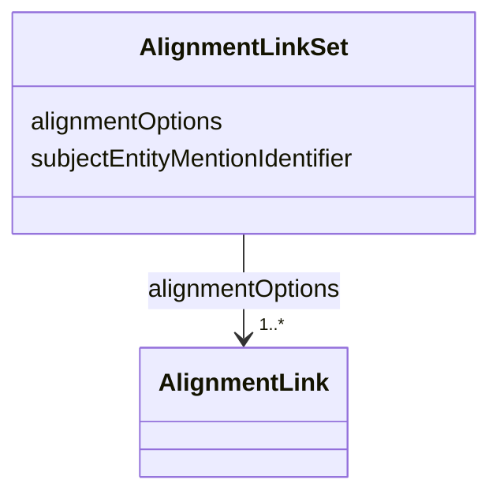

# Class: AlignmentLinkSet 


_A set of alignment links to a referred entity._

__

_Each link in the set represents an entity that might be equivalent to the referred entity,_

_see `AlignmentLink` for details._

__


URI: [ers:AlignmentLinkSet](https://data.europa.eu/ers/schema/AlignmentLinkSet)





<!-- no inheritance hierarchy -->


## Slots

| Name | Cardinality and Range | Description | Inheritance |
| ---  | --- | --- | --- |
| [subjectEntityMentionIdentifier](subjectEntityMentionIdentifier.md) | 1 <br/> [Uri](Uri.md) | The identifier of the entity mention that is the subject of these alignment l... | direct |
| [alignmentOptions](alignmentOptions.md) | 1..* <br/> [AlignmentLink](AlignmentLink.md) | A list of possible matches (alignment links) between the subject entity menti... | direct |


## Usages

| used by | used in | type | used |
| ---  | --- | --- | --- |
| [EntityMentionResolutionResponse](EntityMentionResolutionResponse.md) | [alignmentLinkSet](alignmentLinkSet.md) | range | [AlignmentLinkSet](AlignmentLinkSet.md) |


## Identifier and Mapping Information


### Schema Source


* from schema: https://data.europa.eu/ers/schema


## Mappings

| Mapping Type | Mapped Value |
| ---  | ---  |
| self | ers:AlignmentLinkSet |
| native | ers:AlignmentLinkSet |


## LinkML Source

<!-- TODO: investigate https://stackoverflow.com/questions/37606292/how-to-create-tabbed-code-blocks-in-mkdocs-or-sphinx -->

### Direct

<details>
```yaml
name: AlignmentLinkSet
description: 'A set of alignment links to a referred entity.


  Each link in the set represents an entity that might be equivalent to the referred
  entity,

  see `AlignmentLink` for details.

  '
from_schema: https://data.europa.eu/ers/schema
attributes:
  subjectEntityMentionIdentifier:
    name: subjectEntityMentionIdentifier
    description: 'The identifier of the entity mention that is the subject of these
      alignment links.

      This must match the `identifier` attribute of an `EntityMention` that a resolution
      response

      refers to.

      '
    from_schema: https://data.europa.eu/ers/schema
    rank: 1000
    domain_of:
    - AlignmentLinkSet
    range: uri
    required: true
  alignmentOptions:
    name: alignmentOptions
    description: 'A list of possible matches (alignment links) between the subject
      entity mention

      and candidate canonical entities.


      It is recommended that these are sorted by descending confidence score, although

      that is not mandatory.

      '
    from_schema: https://data.europa.eu/ers/schema
    rank: 1000
    domain_of:
    - AlignmentLinkSet
    range: AlignmentLink
    required: true
    multivalued: true

```
</details>

### Induced

<details>
```yaml
name: AlignmentLinkSet
description: 'A set of alignment links to a referred entity.


  Each link in the set represents an entity that might be equivalent to the referred
  entity,

  see `AlignmentLink` for details.

  '
from_schema: https://data.europa.eu/ers/schema
attributes:
  subjectEntityMentionIdentifier:
    name: subjectEntityMentionIdentifier
    description: 'The identifier of the entity mention that is the subject of these
      alignment links.

      This must match the `identifier` attribute of an `EntityMention` that a resolution
      response

      refers to.

      '
    from_schema: https://data.europa.eu/ers/schema
    rank: 1000
    alias: subjectEntityMentionIdentifier
    owner: AlignmentLinkSet
    domain_of:
    - AlignmentLinkSet
    range: uri
    required: true
  alignmentOptions:
    name: alignmentOptions
    description: 'A list of possible matches (alignment links) between the subject
      entity mention

      and candidate canonical entities.


      It is recommended that these are sorted by descending confidence score, although

      that is not mandatory.

      '
    from_schema: https://data.europa.eu/ers/schema
    rank: 1000
    alias: alignmentOptions
    owner: AlignmentLinkSet
    domain_of:
    - AlignmentLinkSet
    range: AlignmentLink
    required: true
    multivalued: true

```
</details>