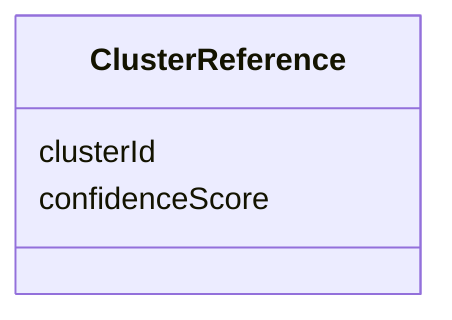

# Class: ClusterReference 


_A reference to a cluster to which an entity is deemed to belong, with an associated confidence score._

__

_A cluster is a set of entity mentions that have been determined to refer to the same real-world entity._

_Each cluster has a unique clusterId._

__

_A cluster reference is used to report the association between an entity mention and a cluster _

_of equivalence._

__


URI: [ere:ClusterReference](https://data.europa.eu/ers/schema/ere/ClusterReference)





<!-- no inheritance hierarchy -->


## Slots

| Name | Cardinality and Range | Description | Inheritance |
| ---  | --- | --- | --- |
| [clusterId](clusterId.md) | 1 <br/> [String](String.md) | The identifier of the cluster/canonical entity that is considered equivalent ... | direct |
| [confidenceScore](confidenceScore.md) | 1 <br/> [Float](Float.md) | A 0-1 value of how confident the ERE is about the equivalence between the sub... | direct |


## Usages

| used by | used in | type | used |
| ---  | --- | --- | --- |
| [EntityMentionResolutionResponse](EntityMentionResolutionResponse.md) | [candidates](candidates.md) | range | [ClusterReference](ClusterReference.md) |


## Identifier and Mapping Information


### Schema Source


* from schema: https://data.europa.eu/ers/schema/ere


## Mappings

| Mapping Type | Mapped Value |
| ---  | ---  |
| self | ere:ClusterReference |
| native | ere:ClusterReference |


## LinkML Source

<!-- TODO: investigate https://stackoverflow.com/questions/37606292/how-to-create-tabbed-code-blocks-in-mkdocs-or-sphinx -->

### Direct

<details>
```yaml
name: ClusterReference
description: "A reference to a cluster to which an entity is deemed to belong, with\
  \ an associated confidence score.\n\nA cluster is a set of entity mentions that\
  \ have been determined to refer to the same real-world entity.\nEach cluster has\
  \ a unique clusterId.\n\nA cluster reference is used to report the association between\
  \ an entity mention and a cluster \nof equivalence.\n"
from_schema: https://data.europa.eu/ers/schema/ere
attributes:
  clusterId:
    name: clusterId
    description: 'The identifier of the cluster/canonical entity that is considered
      equivalent to the

      subject entity mention that an `EntityMentionResolutionResponse` refers to.

      '
    from_schema: https://data.europa.eu/ers/schema/ere
    rank: 1000
    domain_of:
    - ClusterReference
    required: true
  confidenceScore:
    name: confidenceScore
    description: 'A 0-1 value of how confident the ERE is about the equivalence between
      the subject entity mention

      and the target canonical entity.

      '
    from_schema: https://data.europa.eu/ers/schema/ere
    rank: 1000
    domain_of:
    - ClusterReference
    range: float
    required: true
    minimum_value: 0.0
    maximum_value: 1.0

```
</details>

### Induced

<details>
```yaml
name: ClusterReference
description: "A reference to a cluster to which an entity is deemed to belong, with\
  \ an associated confidence score.\n\nA cluster is a set of entity mentions that\
  \ have been determined to refer to the same real-world entity.\nEach cluster has\
  \ a unique clusterId.\n\nA cluster reference is used to report the association between\
  \ an entity mention and a cluster \nof equivalence.\n"
from_schema: https://data.europa.eu/ers/schema/ere
attributes:
  clusterId:
    name: clusterId
    description: 'The identifier of the cluster/canonical entity that is considered
      equivalent to the

      subject entity mention that an `EntityMentionResolutionResponse` refers to.

      '
    from_schema: https://data.europa.eu/ers/schema/ere
    rank: 1000
    alias: clusterId
    owner: ClusterReference
    domain_of:
    - ClusterReference
    range: string
    required: true
  confidenceScore:
    name: confidenceScore
    description: 'A 0-1 value of how confident the ERE is about the equivalence between
      the subject entity mention

      and the target canonical entity.

      '
    from_schema: https://data.europa.eu/ers/schema/ere
    rank: 1000
    alias: confidenceScore
    owner: ClusterReference
    domain_of:
    - ClusterReference
    range: float
    required: true
    minimum_value: 0.0
    maximum_value: 1.0

```
</details>