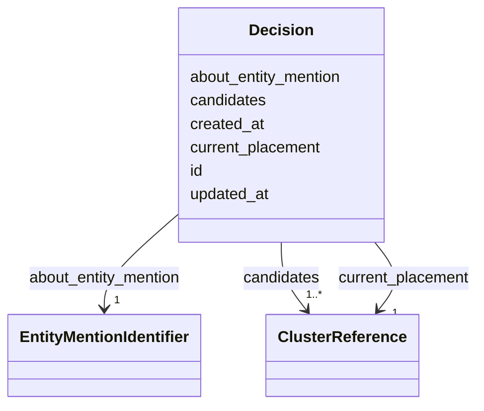

# Class: Decision 


_Canonical placement of an entity mention to a cluster._

_Represents the latest resolution decision (from ERE or curator override)._

__


URI: [ere:Decision](https://data.europa.eu/ers/schema/ere/Decision)





<!-- no inheritance hierarchy -->


## Slots

| Name | Cardinality and Range | Description | Inheritance |
| ---  | --- | --- | --- |
| [id](id.md) | 1 <br/> [String](String.md) | Unique decision identifier | direct |
| [about_entity_mention](about_entity_mention.md) | 1 <br/> [EntityMentionIdentifier](EntityMentionIdentifier.md) | The entity mention being resolved | direct |
| [current_placement](current_placement.md) | 1 <br/> [ClusterReference](ClusterReference.md) | The accepted cluster for this mention (latest from ERE or curator) | direct |
| [candidates](candidates.md) | 1..* <br/> [ClusterReference](ClusterReference.md) | Top-N alternative clusters proposed by ERE (for curation UI preview) | direct |
| [created_at](created_at.md) | 1 <br/> [Datetime](Datetime.md) | When the decision was first created | direct |
| [updated_at](updated_at.md) | 0..1 <br/> [Datetime](Datetime.md) | When the decision was last updated (ERE refresh or curator action) | direct |


## Identifier and Mapping Information


### Schema Source


* from schema: https://data.europa.eu/ers/schema/ere


## Mappings

| Mapping Type | Mapped Value |
| ---  | ---  |
| self | ere:Decision |
| native | ere:Decision |


## LinkML Source

<!-- TODO: investigate https://stackoverflow.com/questions/37606292/how-to-create-tabbed-code-blocks-in-mkdocs-or-sphinx -->

### Direct

<details>
```yaml
name: Decision
description: 'Canonical placement of an entity mention to a cluster.

  Represents the latest resolution decision (from ERE or curator override).

  '
from_schema: https://data.europa.eu/ers/schema/ere
attributes:
  id:
    name: id
    description: Unique decision identifier
    from_schema: https://data.europa.eu/ers/schema/ers
    rank: 1000
    domain_of:
    - Decision
    - UserAction
    required: true
  about_entity_mention:
    name: about_entity_mention
    description: The entity mention being resolved
    from_schema: https://data.europa.eu/ers/schema/ers
    rank: 1000
    domain_of:
    - Decision
    - UserAction
    range: EntityMentionIdentifier
    required: true
  current_placement:
    name: current_placement
    description: 'The accepted cluster for this mention (latest from ERE or curator).

      '
    from_schema: https://data.europa.eu/ers/schema/ers
    rank: 1000
    domain_of:
    - Decision
    range: ClusterReference
    required: true
  candidates:
    name: candidates
    description: 'Top-N alternative clusters proposed by ERE (for curation UI preview).

      '
    from_schema: https://data.europa.eu/ers/schema/ers
    domain_of:
    - EntityMentionResolutionResponse
    - Decision
    - UserAction
    range: ClusterReference
    required: true
    multivalued: true
  created_at:
    name: created_at
    description: When the decision was first created
    from_schema: https://data.europa.eu/ers/schema/ers
    rank: 1000
    domain_of:
    - Decision
    - UserAction
    range: datetime
    required: true
  updated_at:
    name: updated_at
    description: When the decision was last updated (ERE refresh or curator action)
    from_schema: https://data.europa.eu/ers/schema/ers
    rank: 1000
    domain_of:
    - Decision
    range: datetime

```
</details>

### Induced

<details>
```yaml
name: Decision
description: 'Canonical placement of an entity mention to a cluster.

  Represents the latest resolution decision (from ERE or curator override).

  '
from_schema: https://data.europa.eu/ers/schema/ere
attributes:
  id:
    name: id
    description: Unique decision identifier
    from_schema: https://data.europa.eu/ers/schema/ers
    rank: 1000
    alias: id
    owner: Decision
    domain_of:
    - Decision
    - UserAction
    range: string
    required: true
  about_entity_mention:
    name: about_entity_mention
    description: The entity mention being resolved
    from_schema: https://data.europa.eu/ers/schema/ers
    rank: 1000
    alias: about_entity_mention
    owner: Decision
    domain_of:
    - Decision
    - UserAction
    range: EntityMentionIdentifier
    required: true
  current_placement:
    name: current_placement
    description: 'The accepted cluster for this mention (latest from ERE or curator).

      '
    from_schema: https://data.europa.eu/ers/schema/ers
    rank: 1000
    alias: current_placement
    owner: Decision
    domain_of:
    - Decision
    range: ClusterReference
    required: true
  candidates:
    name: candidates
    description: 'Top-N alternative clusters proposed by ERE (for curation UI preview).

      '
    from_schema: https://data.europa.eu/ers/schema/ers
    alias: candidates
    owner: Decision
    domain_of:
    - EntityMentionResolutionResponse
    - Decision
    - UserAction
    range: ClusterReference
    required: true
    multivalued: true
  created_at:
    name: created_at
    description: When the decision was first created
    from_schema: https://data.europa.eu/ers/schema/ers
    rank: 1000
    alias: created_at
    owner: Decision
    domain_of:
    - Decision
    - UserAction
    range: datetime
    required: true
  updated_at:
    name: updated_at
    description: When the decision was last updated (ERE refresh or curator action)
    from_schema: https://data.europa.eu/ers/schema/ers
    rank: 1000
    alias: updated_at
    owner: Decision
    domain_of:
    - Decision
    range: datetime

```
</details>