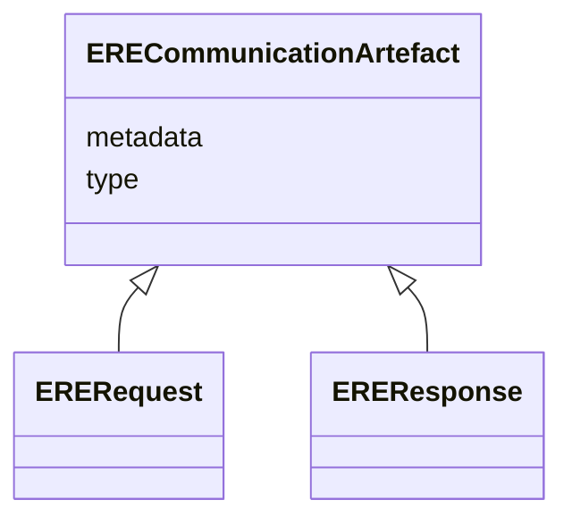

# Class: ERECommunicationArtefact 


_Root abstraction to represent attributes common to both requests and results._

_This is modelled as a mixin in LinkML (so that it can't be instantiated directly)._

__


* __NOTE__: this is an abstract class and should not be instantiated directly


URI: [ers:ERECommunicationArtefact](https://data.europa.eu/ers/schema/ERECommunicationArtefact)





<!-- no inheritance hierarchy -->


## Slots

| Name | Cardinality and Range | Description | Inheritance |
| ---  | --- | --- | --- |
| [type](type.md) | 1 <br/> [String](String.md) | The type of the request or result | direct |
| [metadata](metadata.md) | 0..1 <br/> [String](String.md) | An optional arbitrary dictionary of further request metadata | direct |


## Mixin Usage

| mixed into | description |
| --- | --- |
| [ERERequest](ERERequest.md) | Root class to represent all the requests sent to the ERE |
| [EREResponse](EREResponse.md) | Root class to represent all the responses sent by the ERE |


## Identifier and Mapping Information


### Schema Source


* from schema: https://data.europa.eu/ers/schema


## Mappings

| Mapping Type | Mapped Value |
| ---  | ---  |
| self | ers:ERECommunicationArtefact |
| native | ers:ERECommunicationArtefact |


## LinkML Source

<!-- TODO: investigate https://stackoverflow.com/questions/37606292/how-to-create-tabbed-code-blocks-in-mkdocs-or-sphinx -->

### Direct

<details>
```yaml
name: ERECommunicationArtefact
description: 'Root abstraction to represent attributes common to both requests and
  results.

  This is modelled as a mixin in LinkML (so that it can''t be instantiated directly).

  '
from_schema: https://data.europa.eu/ers/schema
abstract: true
mixin: true
attributes:
  type:
    name: type
    description: "The type of the request or result.\n\nAs per LinkML specification,\
      \ `designates_type` is used here in order to allow for this\nslot to tell the\
      \ concrete subclass that an instance (such as a JSON object) belongs to.\n\n\
      In other words, a particular request will have `type` set with values like \n\
      `EntityMentionResolutionRequest` or `EntityResolutionResult`\n"
    from_schema: https://data.europa.eu/ers/schema
    rank: 1000
    designates_type: true
    domain_of:
    - ERECommunicationArtefact
    - EntityMention
    required: true
  metadata:
    name: metadata
    description: 'An optional arbitrary dictionary of further request metadata.

      '
    from_schema: https://data.europa.eu/ers/schema
    rank: 1000
    domain_of:
    - ERECommunicationArtefact

```
</details>

### Induced

<details>
```yaml
name: ERECommunicationArtefact
description: 'Root abstraction to represent attributes common to both requests and
  results.

  This is modelled as a mixin in LinkML (so that it can''t be instantiated directly).

  '
from_schema: https://data.europa.eu/ers/schema
abstract: true
mixin: true
attributes:
  type:
    name: type
    description: "The type of the request or result.\n\nAs per LinkML specification,\
      \ `designates_type` is used here in order to allow for this\nslot to tell the\
      \ concrete subclass that an instance (such as a JSON object) belongs to.\n\n\
      In other words, a particular request will have `type` set with values like \n\
      `EntityMentionResolutionRequest` or `EntityResolutionResult`\n"
    from_schema: https://data.europa.eu/ers/schema
    rank: 1000
    designates_type: true
    alias: type
    owner: ERECommunicationArtefact
    domain_of:
    - ERECommunicationArtefact
    - EntityMention
    range: string
    required: true
  metadata:
    name: metadata
    description: 'An optional arbitrary dictionary of further request metadata.

      '
    from_schema: https://data.europa.eu/ers/schema
    rank: 1000
    alias: metadata
    owner: ERECommunicationArtefact
    domain_of:
    - ERECommunicationArtefact
    range: string

```
</details>