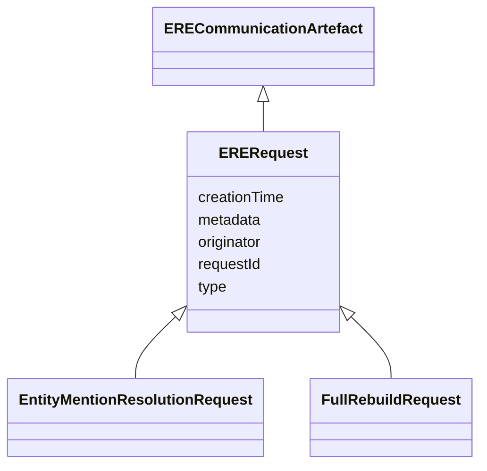

# Class: ERERequest 


_Root class to represent all the requests sent to the ERE._

__


* __NOTE__: this is an abstract class and should not be instantiated directly


URI: [ers:ERERequest](https://data.europa.eu/ers/schema/ERERequest)





## Inheritance
* **ERERequest** [ [ERECommunicationArtefact](ERECommunicationArtefact.md)]
    * [EntityMentionResolutionRequest](EntityMentionResolutionRequest.md)
    * [FullRebuildRequest](FullRebuildRequest.md)


## Slots

| Name | Cardinality and Range | Description | Inheritance |
| ---  | --- | --- | --- |
| [requestId](requestId.md) | 1 <br/> [String](String.md) | A string representing the unique ID of this request | direct |
| [originator](originator.md) | 1 <br/> [String](String.md) | The ID or URI of the request originator | direct |
| [creationTime](creationTime.md) | 0..1 <br/> [Datetime](Datetime.md) | The timestamp when the request was created | direct |
| [type](type.md) | 1 <br/> [String](String.md) | The type of the request or result | [ERECommunicationArtefact](ERECommunicationArtefact.md) |
| [metadata](metadata.md) | 0..1 <br/> [String](String.md) | An optional arbitrary dictionary of further request metadata | [ERECommunicationArtefact](ERECommunicationArtefact.md) |


## Identifier and Mapping Information


### Schema Source


* from schema: https://data.europa.eu/ers/schema


## Mappings

| Mapping Type | Mapped Value |
| ---  | ---  |
| self | ers:ERERequest |
| native | ers:ERERequest |


## LinkML Source

<!-- TODO: investigate https://stackoverflow.com/questions/37606292/how-to-create-tabbed-code-blocks-in-mkdocs-or-sphinx -->

### Direct

<details>
```yaml
name: ERERequest
description: 'Root class to represent all the requests sent to the ERE.

  '
from_schema: https://data.europa.eu/ers/schema
abstract: true
mixins:
- ERECommunicationArtefact
attributes:
  requestId:
    name: requestId
    description: 'A string representing the unique ID of this request.

      '
    from_schema: https://data.europa.eu/ers/schema
    rank: 1000
    domain_of:
    - ERERequest
    - EREResponse
    required: true
  originator:
    name: originator
    description: 'The ID or URI of the request originator.

      '
    from_schema: https://data.europa.eu/ers/schema
    rank: 1000
    domain_of:
    - ERERequest
    required: true
  creationTime:
    name: creationTime
    description: 'The timestamp when the request was created.

      '
    from_schema: https://data.europa.eu/ers/schema
    rank: 1000
    domain_of:
    - ERERequest
    range: datetime

```
</details>

### Induced

<details>
```yaml
name: ERERequest
description: 'Root class to represent all the requests sent to the ERE.

  '
from_schema: https://data.europa.eu/ers/schema
abstract: true
mixins:
- ERECommunicationArtefact
attributes:
  requestId:
    name: requestId
    description: 'A string representing the unique ID of this request.

      '
    from_schema: https://data.europa.eu/ers/schema
    rank: 1000
    alias: requestId
    owner: ERERequest
    domain_of:
    - ERERequest
    - EREResponse
    range: string
    required: true
  originator:
    name: originator
    description: 'The ID or URI of the request originator.

      '
    from_schema: https://data.europa.eu/ers/schema
    rank: 1000
    alias: originator
    owner: ERERequest
    domain_of:
    - ERERequest
    range: string
    required: true
  creationTime:
    name: creationTime
    description: 'The timestamp when the request was created.

      '
    from_schema: https://data.europa.eu/ers/schema
    rank: 1000
    alias: creationTime
    owner: ERERequest
    domain_of:
    - ERERequest
    range: datetime
  type:
    name: type
    description: "The type of the request or result.\n\nAs per LinkML specification,\
      \ `designates_type` is used here in order to allow for this\nslot to tell the\
      \ concrete subclass that an instance (such as a JSON object) belongs to.\n\n\
      In other words, a particular request will have `type` set with values like \n\
      `EntityMentionResolutionRequest` or `EntityResolutionResult`\n"
    from_schema: https://data.europa.eu/ers/schema
    rank: 1000
    designates_type: true
    alias: type
    owner: ERERequest
    domain_of:
    - ERECommunicationArtefact
    - EntityMention
    range: string
    required: true
  metadata:
    name: metadata
    description: 'An optional arbitrary dictionary of further request metadata.

      '
    from_schema: https://data.europa.eu/ers/schema
    rank: 1000
    alias: metadata
    owner: ERERequest
    domain_of:
    - ERECommunicationArtefact
    range: string

```
</details>