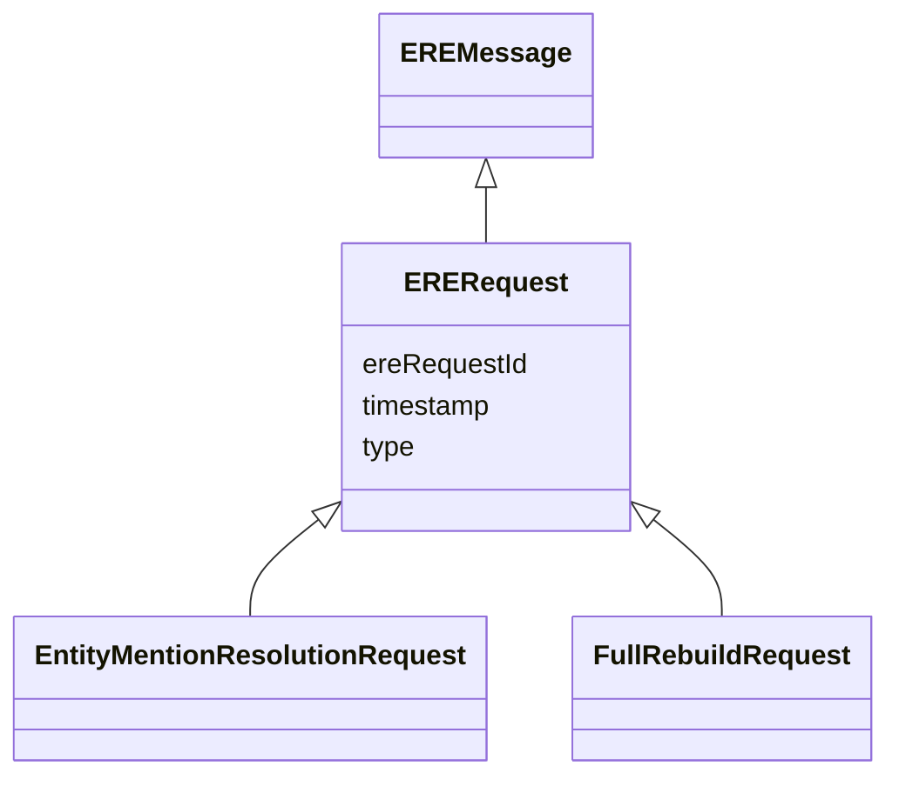

# Class: ERERequest 


_Root class to represent all the requests sent to the ERE._

__


* __NOTE__: this is an abstract class and should not be instantiated directly


URI: [ere:ERERequest](https://data.europa.eu/ers/schema/ere/ERERequest)





## Inheritance
* [EREMessage](EREMessage.md)
    * **ERERequest**
        * [EntityMentionResolutionRequest](EntityMentionResolutionRequest.md)
        * [FullRebuildRequest](FullRebuildRequest.md)


## Slots

| Name | Cardinality and Range | Description | Inheritance |
| ---  | --- | --- | --- |
| [type](type.md) | 1 <br/> [String](String.md) | The type of the request or result | [EREMessage](EREMessage.md) |
| [ereRequestId](ereRequestId.md) | 1 <br/> [String](String.md) | A string representing the unique ID of an ERE request, or the ID of the reque... | [EREMessage](EREMessage.md) |
| [timestamp](timestamp.md) | 0..1 <br/> [Datetime](Datetime.md) | The time when the message was created | [EREMessage](EREMessage.md) |


## Identifier and Mapping Information


### Schema Source


* from schema: https://data.europa.eu/ers/schema/ere


## Mappings

| Mapping Type | Mapped Value |
| ---  | ---  |
| self | ere:ERERequest |
| native | ere:ERERequest |


## LinkML Source

<!-- TODO: investigate https://stackoverflow.com/questions/37606292/how-to-create-tabbed-code-blocks-in-mkdocs-or-sphinx -->

### Direct

<details>
```yaml
name: ERERequest
description: 'Root class to represent all the requests sent to the ERE.

  '
from_schema: https://data.europa.eu/ers/schema/ere
is_a: EREMessage
abstract: true

```
</details>

### Induced

<details>
```yaml
name: ERERequest
description: 'Root class to represent all the requests sent to the ERE.

  '
from_schema: https://data.europa.eu/ers/schema/ere
is_a: EREMessage
abstract: true
attributes:
  type:
    name: type
    description: "The type of the request or result.\n\nAs per LinkML specification,\
      \ `designates_type` is used here in order to allow for this\nslot to tell the\
      \ concrete subclass that an instance (such as a JSON object) belongs to.\n\n\
      In other words, a particular request will have `type` set with values like \n\
      `EntityMentionResolutionRequest` or `EntityResolutionResult`\n"
    from_schema: https://data.europa.eu/ers/schema/ere
    rank: 1000
    designates_type: true
    alias: type
    owner: ERERequest
    domain_of:
    - EREMessage
    range: string
    required: true
  ereRequestId:
    name: ereRequestId
    description: 'A string representing the unique ID of an ERE request, or the ID
      of the request a response is about.

      This **is not** the same as `requestId` + `sourceId`.

      '
    from_schema: https://data.europa.eu/ers/schema/ere
    rank: 1000
    alias: ereRequestId
    owner: ERERequest
    domain_of:
    - EREMessage
    range: string
    required: true
  timestamp:
    name: timestamp
    description: 'The time when the message was created. Should be in ISO-8601 format.

      '
    from_schema: https://data.europa.eu/ers/schema/ere
    rank: 1000
    alias: timestamp
    owner: ERERequest
    domain_of:
    - EREMessage
    range: datetime

```
</details>