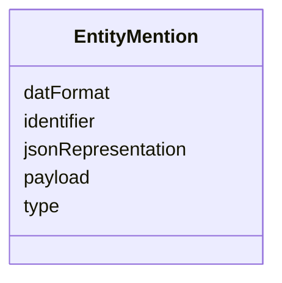

# Class: EntityMention 


_An entity mention is a representation of a real-world entity in the ERS. It must have _

_a data content and a data format, so that components like the ERE can use them for resolution._

__

_Moreover, an entity mention must have a computed identifier (see below)._

__


URI: [ers:EntityMention](https://data.europa.eu/ers/schema/EntityMention)





<!-- no inheritance hierarchy -->


## Slots

| Name | Cardinality and Range | Description | Inheritance |
| ---  | --- | --- | --- |
| [identifier](identifier.md) | 1 <br/> [Uri](Uri.md) | An URI identifying the entity | direct |
| [type](type.md) | 1 <br/> [String](String.md) | A string representing the entity type URI (based on CET) | direct |
| [datFormat](datFormat.md) | 0..1 <br/> [String](String.md) | A string about the MIME format of `payload` (e | direct |
| [payload](payload.md) | 0..1 <br/> [String](String.md) | A code string representing the entity details (eg, RDF description) | direct |
| [jsonRepresentation](jsonRepresentation.md) | 0..1 <br/> [String](String.md) | An optional JSON representation of the entity, which is usually achieved from... | direct |


## Usages

| used by | used in | type | used |
| ---  | --- | --- | --- |
| [EntityMentionResolutionRequest](EntityMentionResolutionRequest.md) | [entityMention](entityMention.md) | range | [EntityMention](EntityMention.md) |


## Identifier and Mapping Information


### Schema Source


* from schema: https://data.europa.eu/ers/schema


## Mappings

| Mapping Type | Mapped Value |
| ---  | ---  |
| self | ers:EntityMention |
| native | ers:EntityMention |


## LinkML Source

<!-- TODO: investigate https://stackoverflow.com/questions/37606292/how-to-create-tabbed-code-blocks-in-mkdocs-or-sphinx -->

### Direct

<details>
```yaml
name: EntityMention
description: "An entity mention is a representation of a real-world entity in the\
  \ ERS. It must have \na data content and a data format, so that components like\
  \ the ERE can use them for resolution.\n\nMoreover, an entity mention must have\
  \ a computed identifier (see below).\n"
from_schema: https://data.europa.eu/ers/schema
attributes:
  identifier:
    name: identifier
    description: "An URI identifying the entity.\n\nWhile mandatory, this can be computed,\
      \ using same function that depends on the entity payload.\nIn that case, **there\
      \ must be** a single function in the whole ERS (including the ERE) that\ncomputes\
      \ the same identifier for the same payload, eg, a hash, an RDF URI extractor.\
      \ This is\nneeded for the resolution results to refer to the correct request\
      \ entities.        \n"
    from_schema: https://data.europa.eu/ers/schema
    rank: 1000
    domain_of:
    - EntityMention
    range: uri
    required: true
  type:
    name: type
    description: "A string representing the entity type URI (based on CET).\n\nNote\
      \ that we don't use the `designates_type` thing here, since entities or canonical\
      \ entities \nare always used in clearly distinct contexts.\n"
    from_schema: https://data.europa.eu/ers/schema
    domain_of:
    - ERECommunicationArtefact
    - EntityMention
    required: true
  datFormat:
    name: datFormat
    description: 'A string about the MIME format of `payload` (e.g. text/turtle, application/ld+json)

      '
    from_schema: https://data.europa.eu/ers/schema
    rank: 1000
    domain_of:
    - EntityMention
  payload:
    name: payload
    description: 'A code string representing the entity details (eg, RDF description).

      '
    from_schema: https://data.europa.eu/ers/schema
    rank: 1000
    domain_of:
    - EntityMention
  jsonRepresentation:
    name: jsonRepresentation
    description: 'An optional JSON representation of the entity, which is usually
      achieved from the payload.

      This is mainly useful for the curation app.

      '
    from_schema: https://data.europa.eu/ers/schema
    rank: 1000
    domain_of:
    - EntityMention

```
</details>

### Induced

<details>
```yaml
name: EntityMention
description: "An entity mention is a representation of a real-world entity in the\
  \ ERS. It must have \na data content and a data format, so that components like\
  \ the ERE can use them for resolution.\n\nMoreover, an entity mention must have\
  \ a computed identifier (see below).\n"
from_schema: https://data.europa.eu/ers/schema
attributes:
  identifier:
    name: identifier
    description: "An URI identifying the entity.\n\nWhile mandatory, this can be computed,\
      \ using same function that depends on the entity payload.\nIn that case, **there\
      \ must be** a single function in the whole ERS (including the ERE) that\ncomputes\
      \ the same identifier for the same payload, eg, a hash, an RDF URI extractor.\
      \ This is\nneeded for the resolution results to refer to the correct request\
      \ entities.        \n"
    from_schema: https://data.europa.eu/ers/schema
    rank: 1000
    alias: identifier
    owner: EntityMention
    domain_of:
    - EntityMention
    range: uri
    required: true
  type:
    name: type
    description: "A string representing the entity type URI (based on CET).\n\nNote\
      \ that we don't use the `designates_type` thing here, since entities or canonical\
      \ entities \nare always used in clearly distinct contexts.\n"
    from_schema: https://data.europa.eu/ers/schema
    alias: type
    owner: EntityMention
    domain_of:
    - ERECommunicationArtefact
    - EntityMention
    range: string
    required: true
  datFormat:
    name: datFormat
    description: 'A string about the MIME format of `payload` (e.g. text/turtle, application/ld+json)

      '
    from_schema: https://data.europa.eu/ers/schema
    rank: 1000
    alias: datFormat
    owner: EntityMention
    domain_of:
    - EntityMention
    range: string
  payload:
    name: payload
    description: 'A code string representing the entity details (eg, RDF description).

      '
    from_schema: https://data.europa.eu/ers/schema
    rank: 1000
    alias: payload
    owner: EntityMention
    domain_of:
    - EntityMention
    range: string
  jsonRepresentation:
    name: jsonRepresentation
    description: 'An optional JSON representation of the entity, which is usually
      achieved from the payload.

      This is mainly useful for the curation app.

      '
    from_schema: https://data.europa.eu/ers/schema
    rank: 1000
    alias: jsonRepresentation
    owner: EntityMention
    domain_of:
    - EntityMention
    range: string

```
</details>