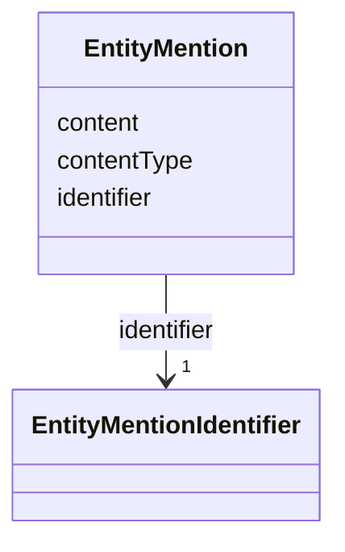

# Class: EntityMention 


_An entity mention is a representation of a real-world entity, as provided by the ERS._

_It contains the entity data, along with metadata like type and format.      _

__


URI: [ers:EntityMention](https://data.europa.eu/ers/schema/EntityMention)





<!-- no inheritance hierarchy -->


## Slots

| Name | Cardinality and Range | Description | Inheritance |
| ---  | --- | --- | --- |
| [identifier](identifier.md) | 1 <br/> [EntityMentionIdentifier](EntityMentionIdentifier.md) | The identifier (with the ERS-derived components) of the entity mention | direct |
| [contentType](contentType.md) | 1 <br/> [String](String.md) | A string about the MIME format of `content` (e | direct |
| [content](content.md) | 1 <br/> [String](String.md) | A code string representing the entity mention details (eg, RDF or XML descrip... | direct |


## Usages

| used by | used in | type | used |
| ---  | --- | --- | --- |
| [EntityMentionResolutionRequest](EntityMentionResolutionRequest.md) | [entityMention](entityMention.md) | range | [EntityMention](EntityMention.md) |


## Identifier and Mapping Information


### Schema Source


* from schema: https://data.europa.eu/ers/schema


## Mappings

| Mapping Type | Mapped Value |
| ---  | ---  |
| self | ers:EntityMention |
| native | ers:EntityMention |


## LinkML Source

<!-- TODO: investigate https://stackoverflow.com/questions/37606292/how-to-create-tabbed-code-blocks-in-mkdocs-or-sphinx -->

### Direct

<details>
```yaml
name: EntityMention
description: "An entity mention is a representation of a real-world entity, as provided\
  \ by the ERS.\nIt contains the entity data, along with metadata like type and format.\
  \      \n"
from_schema: https://data.europa.eu/ers/schema
attributes:
  identifier:
    name: identifier
    description: 'The identifier (with the ERS-derived components) of the entity mention.

      '
    from_schema: https://data.europa.eu/ers/schema
    rank: 1000
    domain_of:
    - EntityMention
    range: EntityMentionIdentifier
    required: true
  contentType:
    name: contentType
    description: 'A string about the MIME format of `content` (e.g. text/turtle, application/ld+json)

      '
    from_schema: https://data.europa.eu/ers/schema
    rank: 1000
    domain_of:
    - EntityMention
    required: true
  content:
    name: content
    description: 'A code string representing the entity mention details (eg, RDF or
      XML description).

      '
    from_schema: https://data.europa.eu/ers/schema
    rank: 1000
    domain_of:
    - EntityMention
    required: true

```
</details>

### Induced

<details>
```yaml
name: EntityMention
description: "An entity mention is a representation of a real-world entity, as provided\
  \ by the ERS.\nIt contains the entity data, along with metadata like type and format.\
  \      \n"
from_schema: https://data.europa.eu/ers/schema
attributes:
  identifier:
    name: identifier
    description: 'The identifier (with the ERS-derived components) of the entity mention.

      '
    from_schema: https://data.europa.eu/ers/schema
    rank: 1000
    alias: identifier
    owner: EntityMention
    domain_of:
    - EntityMention
    range: EntityMentionIdentifier
    required: true
  contentType:
    name: contentType
    description: 'A string about the MIME format of `content` (e.g. text/turtle, application/ld+json)

      '
    from_schema: https://data.europa.eu/ers/schema
    rank: 1000
    alias: contentType
    owner: EntityMention
    domain_of:
    - EntityMention
    range: string
    required: true
  content:
    name: content
    description: 'A code string representing the entity mention details (eg, RDF or
      XML description).

      '
    from_schema: https://data.europa.eu/ers/schema
    rank: 1000
    alias: content
    owner: EntityMention
    domain_of:
    - EntityMention
    range: string
    required: true

```
</details>