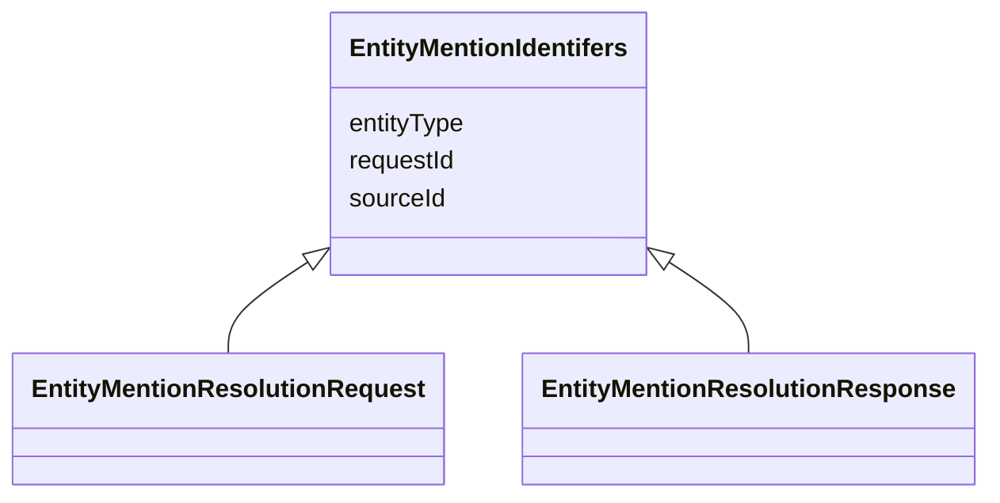

# Class: EntityMentionIdentifers 


_A container that groups the attributes needed to identify an entity mention in a resolution request_

_or response._

__


* __NOTE__: this is an abstract class and should not be instantiated directly


URI: [ers:EntityMentionIdentifers](https://data.europa.eu/ers/schema/EntityMentionIdentifers)





<!-- no inheritance hierarchy -->


## Slots

| Name | Cardinality and Range | Description | Inheritance |
| ---  | --- | --- | --- |
| [sourceId](sourceId.md) | 1 <br/> [String](String.md) | The ID or URI of the ERS client that originated the request | direct |
| [requestId](requestId.md) | 1 <br/> [String](String.md) | A string representing the unique ID of the request made to the ERS system | direct |
| [entityType](entityType.md) | 1 <br/> [String](String.md) | A string representing the entity type (based on CET) | direct |


## Mixin Usage

| mixed into | description |
| --- | --- |
| [EntityMentionResolutionRequest](EntityMentionResolutionRequest.md) | An entity resolution request sent to the ERE, containing the entity to be res... |
| [EntityMentionResolutionResponse](EntityMentionResolutionResponse.md) | An entity resolution response returned by the ERE |


## Identifier and Mapping Information


### Schema Source


* from schema: https://data.europa.eu/ers/schema


## Mappings

| Mapping Type | Mapped Value |
| ---  | ---  |
| self | ers:EntityMentionIdentifers |
| native | ers:EntityMentionIdentifers |


## LinkML Source

<!-- TODO: investigate https://stackoverflow.com/questions/37606292/how-to-create-tabbed-code-blocks-in-mkdocs-or-sphinx -->

### Direct

<details>
```yaml
name: EntityMentionIdentifers
description: 'A container that groups the attributes needed to identify an entity
  mention in a resolution request

  or response.

  '
from_schema: https://data.europa.eu/ers/schema
abstract: true
mixin: true
attributes:
  sourceId:
    name: sourceId
    description: "The ID or URI of the ERS client that originated the request. This\
      \ identifies an application or a \nperson accessing the ERS system.\n"
    from_schema: https://data.europa.eu/ers/schema
    rank: 1000
    domain_of:
    - EntityMentionIdentifers
    required: true
  requestId:
    name: requestId
    description: "A string representing the unique ID of the request made to the ERS\
      \ system. In general, this is unique\nonly within the scope of the source and\
      \ the entity type, ie, within `sourceId` and `entityType`. \n\nMoreover, this\
      \ is **not** the same as `ereRequestId`, which instead, is internal to the ERE\
      \ and is \nused to match responses to requests.\n"
    from_schema: https://data.europa.eu/ers/schema
    rank: 1000
    domain_of:
    - EntityMentionIdentifers
    range: string
    required: true
  entityType:
    name: entityType
    description: "A string representing the entity type (based on CET). This is typically\
      \ a URI.\n\nNote that this is at this level, and not at `EntityMention`, since,\
      \ as said above, \nit's needed to identify the entity, even when its content\
      \ is not present. For the same\nreason, it's used both for `EREResolutionRequest`\
      \ and `EREResolutionResponse` messages., \n"
    from_schema: https://data.europa.eu/ers/schema
    rank: 1000
    domain_of:
    - EntityMentionIdentifers
    required: true

```
</details>

### Induced

<details>
```yaml
name: EntityMentionIdentifers
description: 'A container that groups the attributes needed to identify an entity
  mention in a resolution request

  or response.

  '
from_schema: https://data.europa.eu/ers/schema
abstract: true
mixin: true
attributes:
  sourceId:
    name: sourceId
    description: "The ID or URI of the ERS client that originated the request. This\
      \ identifies an application or a \nperson accessing the ERS system.\n"
    from_schema: https://data.europa.eu/ers/schema
    rank: 1000
    alias: sourceId
    owner: EntityMentionIdentifers
    domain_of:
    - EntityMentionIdentifers
    range: string
    required: true
  requestId:
    name: requestId
    description: "A string representing the unique ID of the request made to the ERS\
      \ system. In general, this is unique\nonly within the scope of the source and\
      \ the entity type, ie, within `sourceId` and `entityType`. \n\nMoreover, this\
      \ is **not** the same as `ereRequestId`, which instead, is internal to the ERE\
      \ and is \nused to match responses to requests.\n"
    from_schema: https://data.europa.eu/ers/schema
    rank: 1000
    alias: requestId
    owner: EntityMentionIdentifers
    domain_of:
    - EntityMentionIdentifers
    range: string
    required: true
  entityType:
    name: entityType
    description: "A string representing the entity type (based on CET). This is typically\
      \ a URI.\n\nNote that this is at this level, and not at `EntityMention`, since,\
      \ as said above, \nit's needed to identify the entity, even when its content\
      \ is not present. For the same\nreason, it's used both for `EREResolutionRequest`\
      \ and `EREResolutionResponse` messages., \n"
    from_schema: https://data.europa.eu/ers/schema
    rank: 1000
    alias: entityType
    owner: EntityMentionIdentifers
    domain_of:
    - EntityMentionIdentifers
    range: string
    required: true

```
</details>