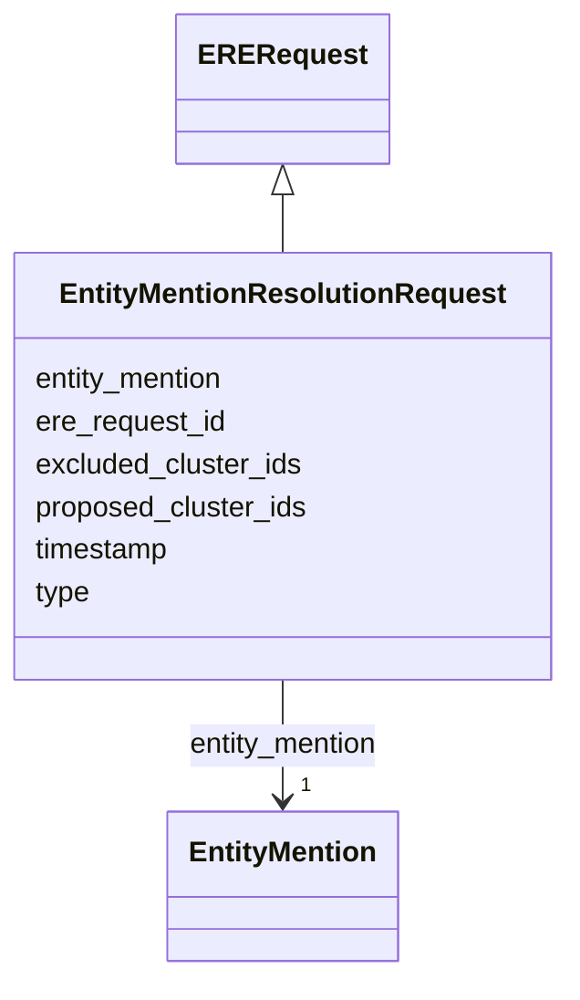

# Class: EntityMentionResolutionRequest 


_An entity resolution request sent to the ERE, containing the entity to be resolved._

__


URI: [ere:EntityMentionResolutionRequest](https://data.europa.eu/ers/schema/ere/EntityMentionResolutionRequest)





## Inheritance
* [EREMessage](EREMessage.md)
    * [ERERequest](ERERequest.md)
        * **EntityMentionResolutionRequest**


## Slots

| Name | Cardinality and Range | Description | Inheritance |
| ---  | --- | --- | --- |
| [entity_mention](entity_mention.md) | 1 <br/> [EntityMention](EntityMention.md) | The data about the entity to be resolved | direct |
| [proposed_cluster_ids](proposed_cluster_ids.md) | * <br/> [String](String.md) | When this is present, the ERE may use this information to try to cluster the ... | direct |
| [excluded_cluster_ids](excluded_cluster_ids.md) | * <br/> [String](String.md) | When this is present, the ERE may use this information to avoid clustering th... | direct |
| [type](type.md) | 1 <br/> [String](String.md) | The type of the request or result | [EREMessage](EREMessage.md) |
| [ere_request_id](ere_request_id.md) | 1 <br/> [String](String.md) | A string representing the unique ID of an ERE request, or the ID of the reque... | [EREMessage](EREMessage.md) |
| [timestamp](timestamp.md) | 0..1 <br/> [Datetime](Datetime.md) | The time when the message was created | [EREMessage](EREMessage.md) |


## Examples

| Value |
| --- |
| {
  "type": "EntityMentionResolutionRequest",
  "entity_mention": { 
    "identifier": {
      "request_id": "324fs3r345vx",
      "source_id": "TEDSWS",
      "entity_type": "http://www.w3.org/ns/org#Organization"
    },
    "content": "epd:ent005 a org:Organization; ...   cccev:telephone \"+44 1924306780\" .",
    "content_type": "text/turtle"
  },
  "timestamp": "2026-01-14T12:34:56Z",
  // As said, we need this internal ID and it can be auto-generated (eg, with UUIDs)
  "ere_request_id": "324fs3r345vx:01"
}
 |
| {
  "type": "EntityMentionResolutionRequest",
  "entity_mention": { 
    "identifier": {
      "request_id": "324fs3r345vxab",
      "source_id": "TEDSWS",
      "entity_type": "http://www.w3.org/ns/org#Organization",
    },
    "content": "epd:ent005 a org:Organization; ...   cccev:telephone \"+44 1924306780\" .",
    "content_type": "text/turtle"
  },
  "excluded_cluster_ids": [
    "324fs3r345vx-bb45we",
    "324fs3r345vx-cc67ui"
  ],
  "timestamp": "2026-01-14T12:40:56Z",
  "ere_request_id": "324fs3r345vxab:01"
}
 |
| {
  "type": "EntityMentionResolutionRequest",
  "entity_mention": { 
    "identifier": {
      "request_id": "324fs3r345vxab",
      "source_id": "TEDSWS",
      "entity_type": "http://www.w3.org/ns/org#Organization",
    },
    "content": "epd:ent005 a org:Organization; ...   cccev:telephone \"+44 1924306780\" .",
    "content_type": "text/turtle"
  },
  "proposed_cluster_ids": [
    // which is sha256 ( source_id + request_id + entity_type )
    "e2e8eea1865aef0e2406ea326520abc252b2afa836ed71434f6a32811904bfad"
  ],
  "timestamp": "2026-01-14T12:40:56Z",
  "ere_request_id": "324fs3r345vxab:01"
} 
 |

## Identifier and Mapping Information


### Schema Source


* from schema: https://data.europa.eu/ers/schema/ere


## Mappings

| Mapping Type | Mapped Value |
| ---  | ---  |
| self | ere:EntityMentionResolutionRequest |
| native | ere:EntityMentionResolutionRequest |


## LinkML Source

<!-- TODO: investigate https://stackoverflow.com/questions/37606292/how-to-create-tabbed-code-blocks-in-mkdocs-or-sphinx -->

### Direct

<details>
```yaml
name: EntityMentionResolutionRequest
description: 'An entity resolution request sent to the ERE, containing the entity
  to be resolved.

  '
examples:
- value: "{\n  \"type\": \"EntityMentionResolutionRequest\",\n  \"entity_mention\"\
    : { \n    \"identifier\": {\n      \"request_id\": \"324fs3r345vx\",\n      \"\
    source_id\": \"TEDSWS\",\n      \"entity_type\": \"http://www.w3.org/ns/org#Organization\"\
    \n    },\n    \"content\": \"epd:ent005 a org:Organization; ...   cccev:telephone\
    \ \\\"+44 1924306780\\\" .\",\n    \"content_type\": \"text/turtle\"\n  },\n \
    \ \"timestamp\": \"2026-01-14T12:34:56Z\",\n  // As said, we need this internal\
    \ ID and it can be auto-generated (eg, with UUIDs)\n  \"ere_request_id\": \"324fs3r345vx:01\"\
    \n}\n"
  description: a regular request
- value: "{\n  \"type\": \"EntityMentionResolutionRequest\",\n  \"entity_mention\"\
    : { \n    \"identifier\": {\n      \"request_id\": \"324fs3r345vxab\",\n     \
    \ \"source_id\": \"TEDSWS\",\n      \"entity_type\": \"http://www.w3.org/ns/org#Organization\"\
    ,\n    },\n    \"content\": \"epd:ent005 a org:Organization; ...   cccev:telephone\
    \ \\\"+44 1924306780\\\" .\",\n    \"content_type\": \"text/turtle\"\n  },\n \
    \ \"excluded_cluster_ids\": [\n    \"324fs3r345vx-bb45we\",\n    \"324fs3r345vx-cc67ui\"\
    \n  ],\n  \"timestamp\": \"2026-01-14T12:40:56Z\",\n  \"ere_request_id\": \"324fs3r345vxab:01\"\
    \n}\n"
  description: a re-rebuild request (ie, carrying a rejection list)
- value: "{\n  \"type\": \"EntityMentionResolutionRequest\",\n  \"entity_mention\"\
    : { \n    \"identifier\": {\n      \"request_id\": \"324fs3r345vxab\",\n     \
    \ \"source_id\": \"TEDSWS\",\n      \"entity_type\": \"http://www.w3.org/ns/org#Organization\"\
    ,\n    },\n    \"content\": \"epd:ent005 a org:Organization; ...   cccev:telephone\
    \ \\\"+44 1924306780\\\" .\",\n    \"content_type\": \"text/turtle\"\n  },\n \
    \ \"proposed_cluster_ids\": [\n    // which is sha256 ( source_id + request_id\
    \ + entity_type )\n    \"e2e8eea1865aef0e2406ea326520abc252b2afa836ed71434f6a32811904bfad\"\
    \n  ],\n  \"timestamp\": \"2026-01-14T12:40:56Z\",\n  \"ere_request_id\": \"324fs3r345vxab:01\"\
    \n} \n"
  description: A request with the entity as proposed cluster ID
from_schema: https://data.europa.eu/ers/schema/ere
is_a: ERERequest
attributes:
  entity_mention:
    name: entity_mention
    description: 'The data about the entity to be resolved. Note that, at least for
      the moment, we don''t support

      batch requests, so this property is single-valued.

      '
    from_schema: https://data.europa.eu/ers/schema/ere
    rank: 1000
    domain_of:
    - EntityMentionResolutionRequest
    range: EntityMention
    required: true
  proposed_cluster_ids:
    name: proposed_cluster_ids
    description: "When this is present, the ERE may use this information to try to\
      \ cluster the entity in one of \nthe listed clusters.\n\nIn particular, when\
      \ an initial request about an entity isn't answered within a timeout, \na subsequent\
      \ new request can be sent about the same entity and with the canonical ID of\
      \ it\nas a single proposed cluster ID. This suggests the ERE that it can create\
      \ a new singleton cluster\nwith the entity as its initial only member and its\
      \ canonical ID as the cluster ID. The ERE\ncan evolve such a cluster later,\
      \ when further similar entities are sent in, or when it \nhas had more time\
      \ to associate the initial entity to others. \n\nWhatever, the case, the ERE\
      \ **has no obligation** to fulfil the proposal, how it reacts to \nthis list\
      \ is implementation dependent, and the ERE remains the ultimate authority to\
      \ provide \nthe final resolution decision.\n"
    from_schema: https://data.europa.eu/ers/schema/ere
    rank: 1000
    domain_of:
    - EntityMentionResolutionRequest
    multivalued: true
  excluded_cluster_ids:
    name: excluded_cluster_ids
    description: "When this is present, the ERE may use this information to avoid\
      \ clustering the entity in \nthe listed clusters.\n\nThis can be used to notify\
      \ the ERE that a curator has rejected a previous resolution \nproposed by the\
      \ ERE.\n\nAs for `proposed_cluster_ids`, the ERE **has no obligation** to fulfil\
      \ the exclusions, and \nit remains the ultimate authority to provide the final\
      \ resolution decision.\n\nSimilarly, the exact reaction to this is implementation\
      \ dependent. In the simplest case, the ERE\nmight just create a singleton cluster\
      \ with the current entity as member. In a more advanced \ncase, it might recompute\
      \ the similarity with more advanced algorithms or use updated\ndata.\n"
    from_schema: https://data.europa.eu/ers/schema/ere
    rank: 1000
    domain_of:
    - EntityMentionResolutionRequest
    multivalued: true

```
</details>

### Induced

<details>
```yaml
name: EntityMentionResolutionRequest
description: 'An entity resolution request sent to the ERE, containing the entity
  to be resolved.

  '
examples:
- value: "{\n  \"type\": \"EntityMentionResolutionRequest\",\n  \"entity_mention\"\
    : { \n    \"identifier\": {\n      \"request_id\": \"324fs3r345vx\",\n      \"\
    source_id\": \"TEDSWS\",\n      \"entity_type\": \"http://www.w3.org/ns/org#Organization\"\
    \n    },\n    \"content\": \"epd:ent005 a org:Organization; ...   cccev:telephone\
    \ \\\"+44 1924306780\\\" .\",\n    \"content_type\": \"text/turtle\"\n  },\n \
    \ \"timestamp\": \"2026-01-14T12:34:56Z\",\n  // As said, we need this internal\
    \ ID and it can be auto-generated (eg, with UUIDs)\n  \"ere_request_id\": \"324fs3r345vx:01\"\
    \n}\n"
  description: a regular request
- value: "{\n  \"type\": \"EntityMentionResolutionRequest\",\n  \"entity_mention\"\
    : { \n    \"identifier\": {\n      \"request_id\": \"324fs3r345vxab\",\n     \
    \ \"source_id\": \"TEDSWS\",\n      \"entity_type\": \"http://www.w3.org/ns/org#Organization\"\
    ,\n    },\n    \"content\": \"epd:ent005 a org:Organization; ...   cccev:telephone\
    \ \\\"+44 1924306780\\\" .\",\n    \"content_type\": \"text/turtle\"\n  },\n \
    \ \"excluded_cluster_ids\": [\n    \"324fs3r345vx-bb45we\",\n    \"324fs3r345vx-cc67ui\"\
    \n  ],\n  \"timestamp\": \"2026-01-14T12:40:56Z\",\n  \"ere_request_id\": \"324fs3r345vxab:01\"\
    \n}\n"
  description: a re-rebuild request (ie, carrying a rejection list)
- value: "{\n  \"type\": \"EntityMentionResolutionRequest\",\n  \"entity_mention\"\
    : { \n    \"identifier\": {\n      \"request_id\": \"324fs3r345vxab\",\n     \
    \ \"source_id\": \"TEDSWS\",\n      \"entity_type\": \"http://www.w3.org/ns/org#Organization\"\
    ,\n    },\n    \"content\": \"epd:ent005 a org:Organization; ...   cccev:telephone\
    \ \\\"+44 1924306780\\\" .\",\n    \"content_type\": \"text/turtle\"\n  },\n \
    \ \"proposed_cluster_ids\": [\n    // which is sha256 ( source_id + request_id\
    \ + entity_type )\n    \"e2e8eea1865aef0e2406ea326520abc252b2afa836ed71434f6a32811904bfad\"\
    \n  ],\n  \"timestamp\": \"2026-01-14T12:40:56Z\",\n  \"ere_request_id\": \"324fs3r345vxab:01\"\
    \n} \n"
  description: A request with the entity as proposed cluster ID
from_schema: https://data.europa.eu/ers/schema/ere
is_a: ERERequest
attributes:
  entity_mention:
    name: entity_mention
    description: 'The data about the entity to be resolved. Note that, at least for
      the moment, we don''t support

      batch requests, so this property is single-valued.

      '
    from_schema: https://data.europa.eu/ers/schema/ere
    rank: 1000
    alias: entity_mention
    owner: EntityMentionResolutionRequest
    domain_of:
    - EntityMentionResolutionRequest
    range: EntityMention
    required: true
  proposed_cluster_ids:
    name: proposed_cluster_ids
    description: "When this is present, the ERE may use this information to try to\
      \ cluster the entity in one of \nthe listed clusters.\n\nIn particular, when\
      \ an initial request about an entity isn't answered within a timeout, \na subsequent\
      \ new request can be sent about the same entity and with the canonical ID of\
      \ it\nas a single proposed cluster ID. This suggests the ERE that it can create\
      \ a new singleton cluster\nwith the entity as its initial only member and its\
      \ canonical ID as the cluster ID. The ERE\ncan evolve such a cluster later,\
      \ when further similar entities are sent in, or when it \nhas had more time\
      \ to associate the initial entity to others. \n\nWhatever, the case, the ERE\
      \ **has no obligation** to fulfil the proposal, how it reacts to \nthis list\
      \ is implementation dependent, and the ERE remains the ultimate authority to\
      \ provide \nthe final resolution decision.\n"
    from_schema: https://data.europa.eu/ers/schema/ere
    rank: 1000
    alias: proposed_cluster_ids
    owner: EntityMentionResolutionRequest
    domain_of:
    - EntityMentionResolutionRequest
    range: string
    multivalued: true
  excluded_cluster_ids:
    name: excluded_cluster_ids
    description: "When this is present, the ERE may use this information to avoid\
      \ clustering the entity in \nthe listed clusters.\n\nThis can be used to notify\
      \ the ERE that a curator has rejected a previous resolution \nproposed by the\
      \ ERE.\n\nAs for `proposed_cluster_ids`, the ERE **has no obligation** to fulfil\
      \ the exclusions, and \nit remains the ultimate authority to provide the final\
      \ resolution decision.\n\nSimilarly, the exact reaction to this is implementation\
      \ dependent. In the simplest case, the ERE\nmight just create a singleton cluster\
      \ with the current entity as member. In a more advanced \ncase, it might recompute\
      \ the similarity with more advanced algorithms or use updated\ndata.\n"
    from_schema: https://data.europa.eu/ers/schema/ere
    rank: 1000
    alias: excluded_cluster_ids
    owner: EntityMentionResolutionRequest
    domain_of:
    - EntityMentionResolutionRequest
    range: string
    multivalued: true
  type:
    name: type
    description: "The type of the request or result.\n\nAs per LinkML specification,\
      \ `designates_type` is used here in order to allow for this\nslot to tell the\
      \ concrete subclass that an instance (such as a JSON object) belongs to.\n\n\
      In other words, a particular request will have `type` set with values like \n\
      `EntityMentionResolutionRequest` or `EntityResolutionResult`\n"
    from_schema: https://data.europa.eu/ers/schema/ere
    rank: 1000
    designates_type: true
    alias: type
    owner: EntityMentionResolutionRequest
    domain_of:
    - EREMessage
    range: string
    required: true
  ere_request_id:
    name: ere_request_id
    description: 'A string representing the unique ID of an ERE request, or the ID
      of the request a response is about.

      This **is not** the same as `request_id` + `source_id`.


      Note on notification responses: as per ERE contract, an `EntityMentionResolutionResponse`
      message

      can originate from within the ERE, without any previous request counterpart,
      as a notification of

      resolution update. In this case, `ere_request_id` has the prefix `ereNotification:`.

      '
    from_schema: https://data.europa.eu/ers/schema/ere
    rank: 1000
    alias: ere_request_id
    owner: EntityMentionResolutionRequest
    domain_of:
    - EREMessage
    range: string
    required: true
  timestamp:
    name: timestamp
    description: 'The time when the message was created. Should be in ISO-8601 format.

      '
    from_schema: https://data.europa.eu/ers/schema/ere
    rank: 1000
    alias: timestamp
    owner: EntityMentionResolutionRequest
    domain_of:
    - EREMessage
    range: datetime

```
</details>