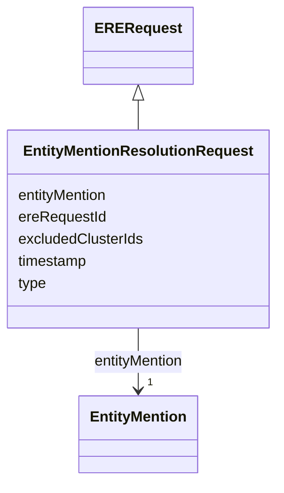

# Class: EntityMentionResolutionRequest 


_An entity resolution request sent to the ERE, containing the entity to be resolved._

__


URI: [ere:EntityMentionResolutionRequest](https://data.europa.eu/ers/schema/ere/EntityMentionResolutionRequest)





## Inheritance
* [EREMessage](EREMessage.md)
    * [ERERequest](ERERequest.md)
        * **EntityMentionResolutionRequest**


## Slots

| Name | Cardinality and Range | Description | Inheritance |
| ---  | --- | --- | --- |
| [entityMention](entityMention.md) | 1 <br/> [EntityMention](EntityMention.md) | The data about the entity to be resolved | direct |
| [excludedClusterIds](excludedClusterIds.md) | * <br/> [String](String.md) | When this is present, the resolution must not bin the entity mention into any... | direct |
| [type](type.md) | 1 <br/> [String](String.md) | The type of the request or result | [EREMessage](EREMessage.md) |
| [ereRequestId](ereRequestId.md) | 1 <br/> [String](String.md) | A string representing the unique ID of an ERE request, or the ID of the reque... | [EREMessage](EREMessage.md) |
| [timestamp](timestamp.md) | 0..1 <br/> [Datetime](Datetime.md) | The time when the message was created | [EREMessage](EREMessage.md) |


## Examples

| Value |
| --- |
| {
  "type": "EntityMentionResolutionRequest",
  "entityMention": { 
    "identifier": {
      "requestId": "324fs3r345vx",
      "sourceId": "TEDSWS",
      "entityType": "http://www.w3.org/ns/org#Organization"
    },
    "content": "epd:ent005 a org:Organization; ...   cccev:telephone \"+44 1924306780\" .",
    "contentType": "text/turtle"
  },
  "timestamp": "2026-01-14T12:34:56Z",
  // As said, we need this internal ID and it can be auto-generated (eg, with UUIDs)
  "ereRequestId": "324fs3r345vx:01"
}
 |
| {
  "type": "EntityMentionResolutionRequest",
  "entityMention": { 
    "identifier": {
      "requestId": "324fs3r345vxab",
      "sourceId": "TEDSWS",
      "entityType": "http://www.w3.org/ns/org#Organization",
    },
    "content": "epd:ent005 a org:Organization; ...   cccev:telephone \"+44 1924306780\" .",
    "contentType": "text/turtle"
  },
  "excludedClusterIds": [
    "324fs3r345vx-bb45we",
    "324fs3r345vx-cc67ui"
  ],
  "timestamp": "2026-01-14T12:40:56Z",
  "ereRequestId": "324fs3r345vxab:01"
}
 |

## Identifier and Mapping Information


### Schema Source


* from schema: https://data.europa.eu/ers/schema/ere


## Mappings

| Mapping Type | Mapped Value |
| ---  | ---  |
| self | ere:EntityMentionResolutionRequest |
| native | ere:EntityMentionResolutionRequest |


## LinkML Source

<!-- TODO: investigate https://stackoverflow.com/questions/37606292/how-to-create-tabbed-code-blocks-in-mkdocs-or-sphinx -->

### Direct

<details>
```yaml
name: EntityMentionResolutionRequest
description: 'An entity resolution request sent to the ERE, containing the entity
  to be resolved.

  '
examples:
- value: "{\n  \"type\": \"EntityMentionResolutionRequest\",\n  \"entityMention\"\
    : { \n    \"identifier\": {\n      \"requestId\": \"324fs3r345vx\",\n      \"\
    sourceId\": \"TEDSWS\",\n      \"entityType\": \"http://www.w3.org/ns/org#Organization\"\
    \n    },\n    \"content\": \"epd:ent005 a org:Organization; ...   cccev:telephone\
    \ \\\"+44 1924306780\\\" .\",\n    \"contentType\": \"text/turtle\"\n  },\n  \"\
    timestamp\": \"2026-01-14T12:34:56Z\",\n  // As said, we need this internal ID\
    \ and it can be auto-generated (eg, with UUIDs)\n  \"ereRequestId\": \"324fs3r345vx:01\"\
    \n}\n"
  description: a regular request
- value: "{\n  \"type\": \"EntityMentionResolutionRequest\",\n  \"entityMention\"\
    : { \n    \"identifier\": {\n      \"requestId\": \"324fs3r345vxab\",\n      \"\
    sourceId\": \"TEDSWS\",\n      \"entityType\": \"http://www.w3.org/ns/org#Organization\"\
    ,\n    },\n    \"content\": \"epd:ent005 a org:Organization; ...   cccev:telephone\
    \ \\\"+44 1924306780\\\" .\",\n    \"contentType\": \"text/turtle\"\n  },\n  \"\
    excludedClusterIds\": [\n    \"324fs3r345vx-bb45we\",\n    \"324fs3r345vx-cc67ui\"\
    \n  ],\n  \"timestamp\": \"2026-01-14T12:40:56Z\",\n  \"ereRequestId\": \"324fs3r345vxab:01\"\
    \n}\n"
  description: a re-rebuild request (ie, carrying a rejection list)
from_schema: https://data.europa.eu/ers/schema/ere
is_a: ERERequest
attributes:
  entityMention:
    name: entityMention
    description: 'The data about the entity to be resolved. Note that, at least for
      the moment, we don''t support

      batch requests, so this property is single-valued.

      '
    from_schema: https://data.europa.eu/ers/schema/ere
    rank: 1000
    domain_of:
    - EntityMentionResolutionRequest
    range: EntityMention
    required: true
  excludedClusterIds:
    name: excludedClusterIds
    description: "When this is present, the resolution must not bin the entity mention\
      \ into any of the\nlisted clusters. This can be used to reject a previous resolution\
      \ proposed by the ERE.\n\nThe exact reaction to this is implementation dependent.\
      \ In the simplest case, the ERE\nmight just create a singleton cluster with\
      \ this entity as member. In a more advanced \ncase, it might recompute the similarity\
      \ with more advanced algorithms or use updated\ndata.\n\nTODO: Can this be revised?\
      \ What does it happen if an exclusion was made by mistake?\n"
    from_schema: https://data.europa.eu/ers/schema/ere
    rank: 1000
    domain_of:
    - EntityMentionResolutionRequest
    multivalued: true

```
</details>

### Induced

<details>
```yaml
name: EntityMentionResolutionRequest
description: 'An entity resolution request sent to the ERE, containing the entity
  to be resolved.

  '
examples:
- value: "{\n  \"type\": \"EntityMentionResolutionRequest\",\n  \"entityMention\"\
    : { \n    \"identifier\": {\n      \"requestId\": \"324fs3r345vx\",\n      \"\
    sourceId\": \"TEDSWS\",\n      \"entityType\": \"http://www.w3.org/ns/org#Organization\"\
    \n    },\n    \"content\": \"epd:ent005 a org:Organization; ...   cccev:telephone\
    \ \\\"+44 1924306780\\\" .\",\n    \"contentType\": \"text/turtle\"\n  },\n  \"\
    timestamp\": \"2026-01-14T12:34:56Z\",\n  // As said, we need this internal ID\
    \ and it can be auto-generated (eg, with UUIDs)\n  \"ereRequestId\": \"324fs3r345vx:01\"\
    \n}\n"
  description: a regular request
- value: "{\n  \"type\": \"EntityMentionResolutionRequest\",\n  \"entityMention\"\
    : { \n    \"identifier\": {\n      \"requestId\": \"324fs3r345vxab\",\n      \"\
    sourceId\": \"TEDSWS\",\n      \"entityType\": \"http://www.w3.org/ns/org#Organization\"\
    ,\n    },\n    \"content\": \"epd:ent005 a org:Organization; ...   cccev:telephone\
    \ \\\"+44 1924306780\\\" .\",\n    \"contentType\": \"text/turtle\"\n  },\n  \"\
    excludedClusterIds\": [\n    \"324fs3r345vx-bb45we\",\n    \"324fs3r345vx-cc67ui\"\
    \n  ],\n  \"timestamp\": \"2026-01-14T12:40:56Z\",\n  \"ereRequestId\": \"324fs3r345vxab:01\"\
    \n}\n"
  description: a re-rebuild request (ie, carrying a rejection list)
from_schema: https://data.europa.eu/ers/schema/ere
is_a: ERERequest
attributes:
  entityMention:
    name: entityMention
    description: 'The data about the entity to be resolved. Note that, at least for
      the moment, we don''t support

      batch requests, so this property is single-valued.

      '
    from_schema: https://data.europa.eu/ers/schema/ere
    rank: 1000
    alias: entityMention
    owner: EntityMentionResolutionRequest
    domain_of:
    - EntityMentionResolutionRequest
    range: EntityMention
    required: true
  excludedClusterIds:
    name: excludedClusterIds
    description: "When this is present, the resolution must not bin the entity mention\
      \ into any of the\nlisted clusters. This can be used to reject a previous resolution\
      \ proposed by the ERE.\n\nThe exact reaction to this is implementation dependent.\
      \ In the simplest case, the ERE\nmight just create a singleton cluster with\
      \ this entity as member. In a more advanced \ncase, it might recompute the similarity\
      \ with more advanced algorithms or use updated\ndata.\n\nTODO: Can this be revised?\
      \ What does it happen if an exclusion was made by mistake?\n"
    from_schema: https://data.europa.eu/ers/schema/ere
    rank: 1000
    alias: excludedClusterIds
    owner: EntityMentionResolutionRequest
    domain_of:
    - EntityMentionResolutionRequest
    range: string
    multivalued: true
  type:
    name: type
    description: "The type of the request or result.\n\nAs per LinkML specification,\
      \ `designates_type` is used here in order to allow for this\nslot to tell the\
      \ concrete subclass that an instance (such as a JSON object) belongs to.\n\n\
      In other words, a particular request will have `type` set with values like \n\
      `EntityMentionResolutionRequest` or `EntityResolutionResult`\n"
    from_schema: https://data.europa.eu/ers/schema/ere
    rank: 1000
    designates_type: true
    alias: type
    owner: EntityMentionResolutionRequest
    domain_of:
    - EREMessage
    range: string
    required: true
  ereRequestId:
    name: ereRequestId
    description: 'A string representing the unique ID of an ERE request, or the ID
      of the request a response is about.

      This **is not** the same as `requestId` + `sourceId`.

      '
    from_schema: https://data.europa.eu/ers/schema/ere
    rank: 1000
    alias: ereRequestId
    owner: EntityMentionResolutionRequest
    domain_of:
    - EREMessage
    range: string
    required: true
  timestamp:
    name: timestamp
    description: 'The time when the message was created. Should be in ISO-8601 format.

      '
    from_schema: https://data.europa.eu/ers/schema/ere
    rank: 1000
    alias: timestamp
    owner: EntityMentionResolutionRequest
    domain_of:
    - EREMessage
    range: datetime

```
</details>