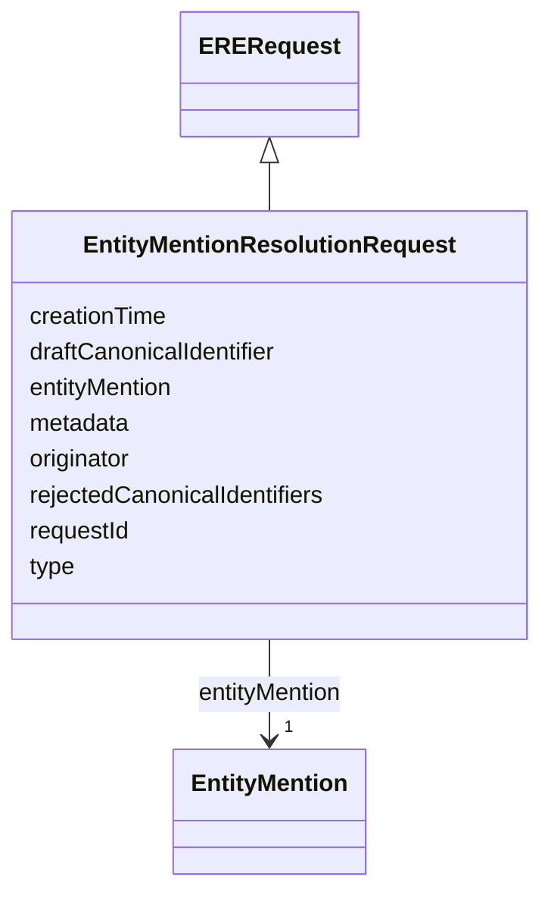

# Class: EntityMentionResolutionRequest 


_An entity resolution request sent to the ERE, containing the entity to be resolved._

__


URI: [ers:EntityMentionResolutionRequest](https://data.europa.eu/ers/schema/EntityMentionResolutionRequest)





## Inheritance
* [ERERequest](ERERequest.md) [ [ERECommunicationArtefact](ERECommunicationArtefact.md)]
    * **EntityMentionResolutionRequest**


## Slots

| Name | Cardinality and Range | Description | Inheritance |
| ---  | --- | --- | --- |
| [entityMention](entityMention.md) | 1 <br/> [EntityMention](EntityMention.md) | The data about the entity to be resolved | direct |
| [draftCanonicalIdentifier](draftCanonicalIdentifier.md) | 0..1 <br/> [Uri](Uri.md) | An optional URI representing a draft canonical identifier for the entity ment... | direct |
| [rejectedCanonicalIdentifiers](rejectedCanonicalIdentifiers.md) | * <br/> [Uri](Uri.md) | When this is present, the request is a refresh request: it is asking that the... | direct |
| [requestId](requestId.md) | 1 <br/> [String](String.md) | A string representing the unique ID of this request | [ERERequest](ERERequest.md) |
| [originator](originator.md) | 1 <br/> [String](String.md) | The ID or URI of the request originator | [ERERequest](ERERequest.md) |
| [creationTime](creationTime.md) | 0..1 <br/> [Datetime](Datetime.md) | The timestamp when the request was created | [ERERequest](ERERequest.md) |
| [type](type.md) | 1 <br/> [String](String.md) | The type of the request or result | [ERECommunicationArtefact](ERECommunicationArtefact.md) |
| [metadata](metadata.md) | 0..1 <br/> [String](String.md) | An optional arbitrary dictionary of further request metadata | [ERECommunicationArtefact](ERECommunicationArtefact.md) |


## Examples

| Value |
| --- |
| {
  "type": "EntityMentionResolutionRequest",            
  "entityMention": 
  { 
    "type": "http://www.w3.org/ns/org#Organization",
    // As said above, there is always a way to compute this
    "identifier": "http://data.europa.eu/ers/id/324fs3r345vx-aa32wa",
    "payload": "epd:ent005 a org:Organization; ...   cccev:telephone \"+44 1924306780\" .",
    "dataFormat": "text/turtle",
    // As Said above, this is optional and JSON-LD is just an example of what it could rendered.
    "jsonRepresentation": {
      "@context": {
        "org": "http://www.w3.org/ns/org#",
        "cccev": "https://data.europa.eu/cc/cefact/code/"
      },
      "@id": "http://data.europa.eu/ers/id/324fs3r345vx-aa32wa",
      "@type": "org:Organization",
      "cccev:telephone": "+44 1924306780"
    }
  },
  "requestId": "324fs3r345vx",
  "originator": "TED SWS pipeline",
  "creationTime": "2026-01-14T12:34:56Z",
  "metadata": {
    "originator system": "VocBench editor",
    "originator timestamp": "23748737643"
  }
}
 |
| {
  "type": "EntityMentionResolutionRequest",            
  "entityMention": 
  { 
    "type": "http://www.w3.org/ns/org#Organization",
    "identifier": "http://data.europa.eu/ers/id/324fs3r345vx-aa32wa",
    "payload": "epd:ent005 a org:Organization; ...   cccev:telephone \"+44 1924306780\" .",
    "dataFormat": "text/turtle"
  },
  "rejectedCanonicalIdentifiers": [
    "http://data.europa.eu/ers/id/324fs3r345vx-bb45we",
    "http://data.europa.eu/ers/id/324fs3r345vx-cc67ui"
  ],
  "requestId": "324fs3r345vx01",
  "originator": "TED SWS pipeline",
  "creationTime": "2026-01-14T12:40:56Z"
}
 |

## Identifier and Mapping Information


### Schema Source


* from schema: https://data.europa.eu/ers/schema


## Mappings

| Mapping Type | Mapped Value |
| ---  | ---  |
| self | ers:EntityMentionResolutionRequest |
| native | ers:EntityMentionResolutionRequest |


## LinkML Source

<!-- TODO: investigate https://stackoverflow.com/questions/37606292/how-to-create-tabbed-code-blocks-in-mkdocs-or-sphinx -->

### Direct

<details>
```yaml
name: EntityMentionResolutionRequest
description: 'An entity resolution request sent to the ERE, containing the entity
  to be resolved.

  '
examples:
- value: "{\n  \"type\": \"EntityMentionResolutionRequest\",            \n  \"entityMention\"\
    : \n  { \n    \"type\": \"http://www.w3.org/ns/org#Organization\",\n    // As\
    \ said above, there is always a way to compute this\n    \"identifier\": \"http://data.europa.eu/ers/id/324fs3r345vx-aa32wa\"\
    ,\n    \"payload\": \"epd:ent005 a org:Organization; ...   cccev:telephone \\\"\
    +44 1924306780\\\" .\",\n    \"dataFormat\": \"text/turtle\",\n    // As Said\
    \ above, this is optional and JSON-LD is just an example of what it could rendered.\n\
    \    \"jsonRepresentation\": {\n      \"@context\": {\n        \"org\": \"http://www.w3.org/ns/org#\"\
    ,\n        \"cccev\": \"https://data.europa.eu/cc/cefact/code/\"\n      },\n \
    \     \"@id\": \"http://data.europa.eu/ers/id/324fs3r345vx-aa32wa\",\n      \"\
    @type\": \"org:Organization\",\n      \"cccev:telephone\": \"+44 1924306780\"\n\
    \    }\n  },\n  \"requestId\": \"324fs3r345vx\",\n  \"originator\": \"TED SWS\
    \ pipeline\",\n  \"creationTime\": \"2026-01-14T12:34:56Z\",\n  \"metadata\":\
    \ {\n    \"originator system\": \"VocBench editor\",\n    \"originator timestamp\"\
    : \"23748737643\"\n  }\n}\n"
  description: a regular request
- value: "{\n  \"type\": \"EntityMentionResolutionRequest\",            \n  \"entityMention\"\
    : \n  { \n    \"type\": \"http://www.w3.org/ns/org#Organization\",\n    \"identifier\"\
    : \"http://data.europa.eu/ers/id/324fs3r345vx-aa32wa\",\n    \"payload\": \"epd:ent005\
    \ a org:Organization; ...   cccev:telephone \\\"+44 1924306780\\\" .\",\n    \"\
    dataFormat\": \"text/turtle\"\n  },\n  \"rejectedCanonicalIdentifiers\": [\n \
    \   \"http://data.europa.eu/ers/id/324fs3r345vx-bb45we\",\n    \"http://data.europa.eu/ers/id/324fs3r345vx-cc67ui\"\
    \n  ],\n  \"requestId\": \"324fs3r345vx01\",\n  \"originator\": \"TED SWS pipeline\"\
    ,\n  \"creationTime\": \"2026-01-14T12:40:56Z\"\n}\n"
  description: a refresh request (ie, carrying a rejection list)
from_schema: https://data.europa.eu/ers/schema
is_a: ERERequest
attributes:
  entityMention:
    name: entityMention
    description: 'The data about the entity to be resolved.

      '
    from_schema: https://data.europa.eu/ers/schema
    rank: 1000
    domain_of:
    - EntityMentionResolutionRequest
    range: EntityMention
    required: true
  draftCanonicalIdentifier:
    name: draftCanonicalIdentifier
    description: "An optional URI representing a draft canonical identifier for the\
      \ entity mention\nin this request.\n\nThe ERS creates this when it still doesn't\
      \ know anything about an entity resolution, for \nthe purpose of quickly replying\
      \ something and postpone a final resolution to when the \nERE has it. The ERE\
      \ must use this ID when it creates a new (typically singleton) cluster\nfor\
      \ this entity mention, if it can't associate the entity to any cluster it already\
      \ knows.\n"
    from_schema: https://data.europa.eu/ers/schema
    rank: 1000
    domain_of:
    - EntityMentionResolutionRequest
    range: uri
  rejectedCanonicalIdentifiers:
    name: rejectedCanonicalIdentifiers
    description: "When this is present, the request is a refresh request: it is asking\
      \ that the entity \nis resolved again and the clusters/canonical entities that\
      \ were previously proposed \nas resolution are now ignored.\n\nThe exact reaction\
      \ to this is implementation dependent. In the simplest case, the ERE\nmight\
      \ just create a singleton cluster with this entity as member. In a more advanced\
      \ \ncase, it might recompute the similarity with more advanced algorithms or\
      \ use updated\ndata.\n"
    from_schema: https://data.europa.eu/ers/schema
    rank: 1000
    domain_of:
    - EntityMentionResolutionRequest
    range: uri
    multivalued: true

```
</details>

### Induced

<details>
```yaml
name: EntityMentionResolutionRequest
description: 'An entity resolution request sent to the ERE, containing the entity
  to be resolved.

  '
examples:
- value: "{\n  \"type\": \"EntityMentionResolutionRequest\",            \n  \"entityMention\"\
    : \n  { \n    \"type\": \"http://www.w3.org/ns/org#Organization\",\n    // As\
    \ said above, there is always a way to compute this\n    \"identifier\": \"http://data.europa.eu/ers/id/324fs3r345vx-aa32wa\"\
    ,\n    \"payload\": \"epd:ent005 a org:Organization; ...   cccev:telephone \\\"\
    +44 1924306780\\\" .\",\n    \"dataFormat\": \"text/turtle\",\n    // As Said\
    \ above, this is optional and JSON-LD is just an example of what it could rendered.\n\
    \    \"jsonRepresentation\": {\n      \"@context\": {\n        \"org\": \"http://www.w3.org/ns/org#\"\
    ,\n        \"cccev\": \"https://data.europa.eu/cc/cefact/code/\"\n      },\n \
    \     \"@id\": \"http://data.europa.eu/ers/id/324fs3r345vx-aa32wa\",\n      \"\
    @type\": \"org:Organization\",\n      \"cccev:telephone\": \"+44 1924306780\"\n\
    \    }\n  },\n  \"requestId\": \"324fs3r345vx\",\n  \"originator\": \"TED SWS\
    \ pipeline\",\n  \"creationTime\": \"2026-01-14T12:34:56Z\",\n  \"metadata\":\
    \ {\n    \"originator system\": \"VocBench editor\",\n    \"originator timestamp\"\
    : \"23748737643\"\n  }\n}\n"
  description: a regular request
- value: "{\n  \"type\": \"EntityMentionResolutionRequest\",            \n  \"entityMention\"\
    : \n  { \n    \"type\": \"http://www.w3.org/ns/org#Organization\",\n    \"identifier\"\
    : \"http://data.europa.eu/ers/id/324fs3r345vx-aa32wa\",\n    \"payload\": \"epd:ent005\
    \ a org:Organization; ...   cccev:telephone \\\"+44 1924306780\\\" .\",\n    \"\
    dataFormat\": \"text/turtle\"\n  },\n  \"rejectedCanonicalIdentifiers\": [\n \
    \   \"http://data.europa.eu/ers/id/324fs3r345vx-bb45we\",\n    \"http://data.europa.eu/ers/id/324fs3r345vx-cc67ui\"\
    \n  ],\n  \"requestId\": \"324fs3r345vx01\",\n  \"originator\": \"TED SWS pipeline\"\
    ,\n  \"creationTime\": \"2026-01-14T12:40:56Z\"\n}\n"
  description: a refresh request (ie, carrying a rejection list)
from_schema: https://data.europa.eu/ers/schema
is_a: ERERequest
attributes:
  entityMention:
    name: entityMention
    description: 'The data about the entity to be resolved.

      '
    from_schema: https://data.europa.eu/ers/schema
    rank: 1000
    alias: entityMention
    owner: EntityMentionResolutionRequest
    domain_of:
    - EntityMentionResolutionRequest
    range: EntityMention
    required: true
  draftCanonicalIdentifier:
    name: draftCanonicalIdentifier
    description: "An optional URI representing a draft canonical identifier for the\
      \ entity mention\nin this request.\n\nThe ERS creates this when it still doesn't\
      \ know anything about an entity resolution, for \nthe purpose of quickly replying\
      \ something and postpone a final resolution to when the \nERE has it. The ERE\
      \ must use this ID when it creates a new (typically singleton) cluster\nfor\
      \ this entity mention, if it can't associate the entity to any cluster it already\
      \ knows.\n"
    from_schema: https://data.europa.eu/ers/schema
    rank: 1000
    alias: draftCanonicalIdentifier
    owner: EntityMentionResolutionRequest
    domain_of:
    - EntityMentionResolutionRequest
    range: uri
  rejectedCanonicalIdentifiers:
    name: rejectedCanonicalIdentifiers
    description: "When this is present, the request is a refresh request: it is asking\
      \ that the entity \nis resolved again and the clusters/canonical entities that\
      \ were previously proposed \nas resolution are now ignored.\n\nThe exact reaction\
      \ to this is implementation dependent. In the simplest case, the ERE\nmight\
      \ just create a singleton cluster with this entity as member. In a more advanced\
      \ \ncase, it might recompute the similarity with more advanced algorithms or\
      \ use updated\ndata.\n"
    from_schema: https://data.europa.eu/ers/schema
    rank: 1000
    alias: rejectedCanonicalIdentifiers
    owner: EntityMentionResolutionRequest
    domain_of:
    - EntityMentionResolutionRequest
    range: uri
    multivalued: true
  requestId:
    name: requestId
    description: 'A string representing the unique ID of this request.

      '
    from_schema: https://data.europa.eu/ers/schema
    rank: 1000
    alias: requestId
    owner: EntityMentionResolutionRequest
    domain_of:
    - ERERequest
    - EREResponse
    range: string
    required: true
  originator:
    name: originator
    description: 'The ID or URI of the request originator.

      '
    from_schema: https://data.europa.eu/ers/schema
    rank: 1000
    alias: originator
    owner: EntityMentionResolutionRequest
    domain_of:
    - ERERequest
    range: string
    required: true
  creationTime:
    name: creationTime
    description: 'The timestamp when the request was created.

      '
    from_schema: https://data.europa.eu/ers/schema
    rank: 1000
    alias: creationTime
    owner: EntityMentionResolutionRequest
    domain_of:
    - ERERequest
    range: datetime
  type:
    name: type
    description: "The type of the request or result.\n\nAs per LinkML specification,\
      \ `designates_type` is used here in order to allow for this\nslot to tell the\
      \ concrete subclass that an instance (such as a JSON object) belongs to.\n\n\
      In other words, a particular request will have `type` set with values like \n\
      `EntityMentionResolutionRequest` or `EntityResolutionResult`\n"
    from_schema: https://data.europa.eu/ers/schema
    rank: 1000
    designates_type: true
    alias: type
    owner: EntityMentionResolutionRequest
    domain_of:
    - ERECommunicationArtefact
    range: string
    required: true
  metadata:
    name: metadata
    description: 'An optional arbitrary dictionary of further request metadata.

      '
    from_schema: https://data.europa.eu/ers/schema
    rank: 1000
    alias: metadata
    owner: EntityMentionResolutionRequest
    domain_of:
    - ERECommunicationArtefact
    range: string

```
</details>