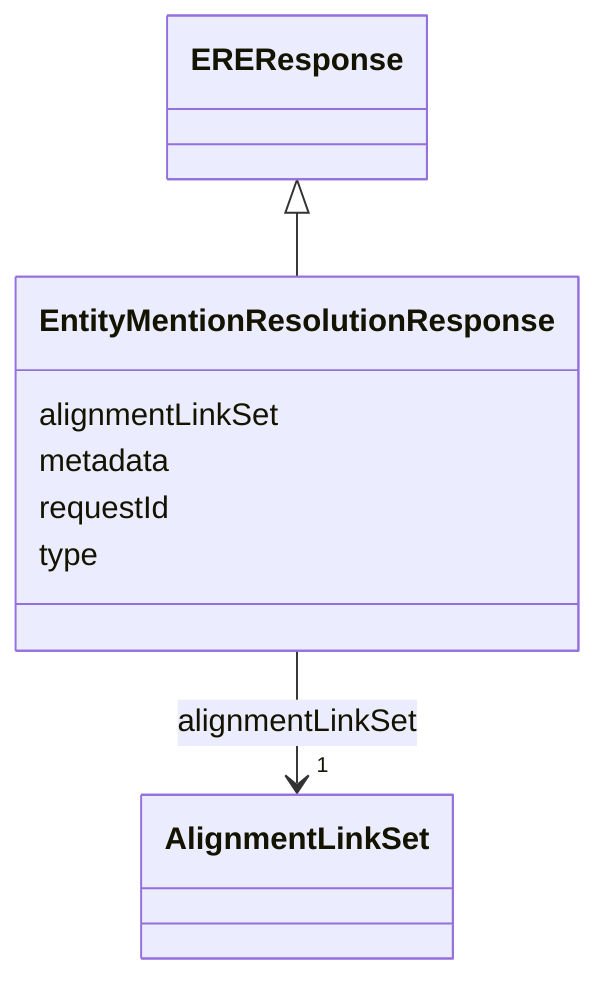

# Class: EntityMentionResolutionResponse 


_An entity resolution response sent by the ERE._

__

_This links an `AlignmentLinkSet`, to represent possible resolutions (see the attribute definition)._

__


URI: [ers:EntityMentionResolutionResponse](https://data.europa.eu/ers/schema/EntityMentionResolutionResponse)





## Inheritance
* [EREResponse](EREResponse.md) [ [ERECommunicationArtefact](ERECommunicationArtefact.md)]
    * **EntityMentionResolutionResponse**


## Slots

| Name | Cardinality and Range | Description | Inheritance |
| ---  | --- | --- | --- |
| [alignmentLinkSet](alignmentLinkSet.md) | 1 <br/> [AlignmentLinkSet](AlignmentLinkSet.md) | The set of alignment links representing the candidate canonical entities/clus... | direct |
| [requestId](requestId.md) | 1 <br/> [String](String.md) | A string representing the unique ID of the request this response is about | [EREResponse](EREResponse.md) |
| [type](type.md) | 1 <br/> [String](String.md) | The type of the request or result | [ERECommunicationArtefact](ERECommunicationArtefact.md) |
| [metadata](metadata.md) | 0..1 <br/> [String](String.md) | An optional arbitrary dictionary of further request metadata | [ERECommunicationArtefact](ERECommunicationArtefact.md) |


## Examples

| Value |
| --- |
| {
  "type": "EntityMentionResolutionResponse",
  "requestId": "324fs3r345vx",
  "alignmentLinkSet": {
    "subjectEntityMentionIdentifier": "http://data.europa.eu/ers/id/324fs3r345vx-q11rea",
    "alignmentOptions": [
      { 
        "canonicalIdentifier": "http://data.europa.eu/ers/id/324fs3r345vx-aa32wa",
        "confidenceScore": 0.91
      },
      { 
        "canonicalIdentifier": "http://data.europa.eu/ers/id/324fs3r345vx-bb45we",
        "confidenceScore": 0.65
      }
    ]
  }
}
    
 |

## Identifier and Mapping Information


### Schema Source


* from schema: https://data.europa.eu/ers/schema


## Mappings

| Mapping Type | Mapped Value |
| ---  | ---  |
| self | ers:EntityMentionResolutionResponse |
| native | ers:EntityMentionResolutionResponse |


## LinkML Source

<!-- TODO: investigate https://stackoverflow.com/questions/37606292/how-to-create-tabbed-code-blocks-in-mkdocs-or-sphinx -->

### Direct

<details>
```yaml
name: EntityMentionResolutionResponse
description: 'An entity resolution response sent by the ERE.


  This links an `AlignmentLinkSet`, to represent possible resolutions (see the attribute
  definition).

  '
examples:
- value: "{\n  \"type\": \"EntityMentionResolutionResponse\",\n  \"requestId\": \"\
    324fs3r345vx\",\n  \"alignmentLinkSet\": {\n    \"subjectEntityMentionIdentifier\"\
    : \"http://data.europa.eu/ers/id/324fs3r345vx-q11rea\",\n    \"alignmentOptions\"\
    : [\n      { \n        \"canonicalIdentifier\": \"http://data.europa.eu/ers/id/324fs3r345vx-aa32wa\"\
    ,\n        \"confidenceScore\": 0.91\n      },\n      { \n        \"canonicalIdentifier\"\
    : \"http://data.europa.eu/ers/id/324fs3r345vx-bb45we\",\n        \"confidenceScore\"\
    : 0.65\n      }\n    ]\n  }\n}\n    \n"
from_schema: https://data.europa.eu/ers/schema
is_a: EREResponse
attributes:
  alignmentLinkSet:
    name: alignmentLinkSet
    description: 'The set of alignment links representing the candidate canonical
      entities/clusters

      that the entity mention in the original request could align to (be equivalent
      to).


      **Note**: for the moment, this is not multi-valued, since we don''t support
      batch requests (yet?),

      thus there is only one set in a response, that resolves for the single entity
      mention in the

      original request (with multiple alignment candidates). If, in the future, we
      support batch requests,

      then we might need to return one alignment link set per entity mention in a
      request.

      '
    from_schema: https://data.europa.eu/ers/schema
    rank: 1000
    domain_of:
    - EntityMentionResolutionResponse
    range: AlignmentLinkSet
    required: true

```
</details>

### Induced

<details>
```yaml
name: EntityMentionResolutionResponse
description: 'An entity resolution response sent by the ERE.


  This links an `AlignmentLinkSet`, to represent possible resolutions (see the attribute
  definition).

  '
examples:
- value: "{\n  \"type\": \"EntityMentionResolutionResponse\",\n  \"requestId\": \"\
    324fs3r345vx\",\n  \"alignmentLinkSet\": {\n    \"subjectEntityMentionIdentifier\"\
    : \"http://data.europa.eu/ers/id/324fs3r345vx-q11rea\",\n    \"alignmentOptions\"\
    : [\n      { \n        \"canonicalIdentifier\": \"http://data.europa.eu/ers/id/324fs3r345vx-aa32wa\"\
    ,\n        \"confidenceScore\": 0.91\n      },\n      { \n        \"canonicalIdentifier\"\
    : \"http://data.europa.eu/ers/id/324fs3r345vx-bb45we\",\n        \"confidenceScore\"\
    : 0.65\n      }\n    ]\n  }\n}\n    \n"
from_schema: https://data.europa.eu/ers/schema
is_a: EREResponse
attributes:
  alignmentLinkSet:
    name: alignmentLinkSet
    description: 'The set of alignment links representing the candidate canonical
      entities/clusters

      that the entity mention in the original request could align to (be equivalent
      to).


      **Note**: for the moment, this is not multi-valued, since we don''t support
      batch requests (yet?),

      thus there is only one set in a response, that resolves for the single entity
      mention in the

      original request (with multiple alignment candidates). If, in the future, we
      support batch requests,

      then we might need to return one alignment link set per entity mention in a
      request.

      '
    from_schema: https://data.europa.eu/ers/schema
    rank: 1000
    alias: alignmentLinkSet
    owner: EntityMentionResolutionResponse
    domain_of:
    - EntityMentionResolutionResponse
    range: AlignmentLinkSet
    required: true
  requestId:
    name: requestId
    description: 'A string representing the unique ID of the request this response
      is about.

      '
    from_schema: https://data.europa.eu/ers/schema
    alias: requestId
    owner: EntityMentionResolutionResponse
    domain_of:
    - ERERequest
    - EREResponse
    range: string
    required: true
  type:
    name: type
    description: "The type of the request or result.\n\nAs per LinkML specification,\
      \ `designates_type` is used here in order to allow for this\nslot to tell the\
      \ concrete subclass that an instance (such as a JSON object) belongs to.\n\n\
      In other words, a particular request will have `type` set with values like \n\
      `EntityMentionResolutionRequest` or `EntityResolutionResult`\n"
    from_schema: https://data.europa.eu/ers/schema
    rank: 1000
    designates_type: true
    alias: type
    owner: EntityMentionResolutionResponse
    domain_of:
    - ERECommunicationArtefact
    - EntityMention
    range: string
    required: true
  metadata:
    name: metadata
    description: 'An optional arbitrary dictionary of further request metadata.

      '
    from_schema: https://data.europa.eu/ers/schema
    rank: 1000
    alias: metadata
    owner: EntityMentionResolutionResponse
    domain_of:
    - ERECommunicationArtefact
    range: string

```
</details>