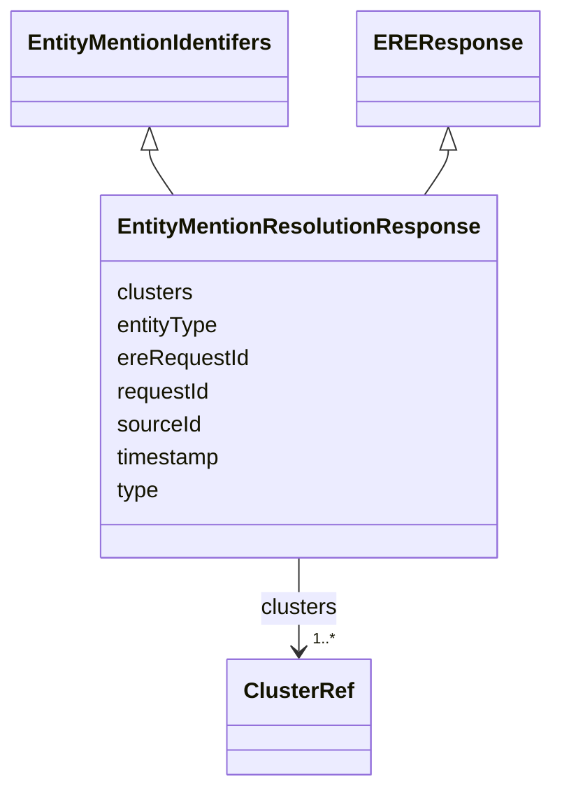

# Class: EntityMentionResolutionResponse 


_An entity resolution response returned by the ERE._

__

_This is basically a list of candidate clusters to which the entity is deemed to be equivalent._

__

_Note that, for the moment, we don't support batch requests. In future, we might support requests_

_with multiple subjects in the `EntityMention` content (eg, RDF with multiple subjects), in which case _

_we might need to return multiple `EntityMentionResolutionResponse` messages, each with additional _

_properties such as `entityIndex` and `totalEntities`._

__


URI: [ers:EntityMentionResolutionResponse](https://data.europa.eu/ers/schema/EntityMentionResolutionResponse)





## Inheritance
* [EREMessage](EREMessage.md)
    * [EREResponse](EREResponse.md)
        * **EntityMentionResolutionResponse** [ [EntityMentionIdentifers](EntityMentionIdentifers.md)]


## Slots

| Name | Cardinality and Range | Description | Inheritance |
| ---  | --- | --- | --- |
| [clusters](clusters.md) | 1..* <br/> [ClusterRef](ClusterRef.md) | The set of cluster reference/score pairs representing the candidate clusters | direct |
| [sourceId](sourceId.md) | 1 <br/> [String](String.md) | The ID or URI of the ERS client that originated the request | [EntityMentionIdentifers](EntityMentionIdentifers.md) |
| [requestId](requestId.md) | 1 <br/> [String](String.md) | A string representing the unique ID of the request made to the ERS system | [EntityMentionIdentifers](EntityMentionIdentifers.md) |
| [entityType](entityType.md) | 1 <br/> [String](String.md) | A string representing the entity type (based on CET) | [EntityMentionIdentifers](EntityMentionIdentifers.md) |
| [type](type.md) | 1 <br/> [String](String.md) | The type of the request or result | [EREMessage](EREMessage.md) |
| [ereRequestId](ereRequestId.md) | 1 <br/> [String](String.md) | A string representing the unique ID of an ERE request, or the ID of the reque... | [EREMessage](EREMessage.md) |
| [timestamp](timestamp.md) | 0..1 <br/> [Datetime](Datetime.md) | The time when the message was created | [EREMessage](EREMessage.md) |


## Examples

| Value |
| --- |
| {
  "type": "EntityMentionResolutionResponse",
  "requestId": "324fs3r345vx",
  "sourceId": "TEDSWS",
  "entityType": "http://www.w3.org/ns/org#Organization",
  "clusters": [
    { 
      "clusterId": "324fs3r345vx-aa32wa",
      "confidenceScore": 0.91
    },
    { 
      "clusterId": "324fs3r345vx-bb45we",
      "confidenceScore": 0.65
    }
  ],
  "timestamp": "2026-01-14T12:34:59Z",
  "ereRequestId": "324fs3r345vx:01"
}
    
 |

## Identifier and Mapping Information


### Schema Source


* from schema: https://data.europa.eu/ers/schema


## Mappings

| Mapping Type | Mapped Value |
| ---  | ---  |
| self | ers:EntityMentionResolutionResponse |
| native | ers:EntityMentionResolutionResponse |


## LinkML Source

<!-- TODO: investigate https://stackoverflow.com/questions/37606292/how-to-create-tabbed-code-blocks-in-mkdocs-or-sphinx -->

### Direct

<details>
```yaml
name: EntityMentionResolutionResponse
description: "An entity resolution response returned by the ERE.\n\nThis is basically\
  \ a list of candidate clusters to which the entity is deemed to be equivalent.\n\
  \nNote that, for the moment, we don't support batch requests. In future, we might\
  \ support requests\nwith multiple subjects in the `EntityMention` content (eg, RDF\
  \ with multiple subjects), in which case \nwe might need to return multiple `EntityMentionResolutionResponse`\
  \ messages, each with additional \nproperties such as `entityIndex` and `totalEntities`.\n"
examples:
- value: "{\n  \"type\": \"EntityMentionResolutionResponse\",\n  \"requestId\": \"\
    324fs3r345vx\",\n  \"sourceId\": \"TEDSWS\",\n  \"entityType\": \"http://www.w3.org/ns/org#Organization\"\
    ,\n  \"clusters\": [\n    { \n      \"clusterId\": \"324fs3r345vx-aa32wa\",\n\
    \      \"confidenceScore\": 0.91\n    },\n    { \n      \"clusterId\": \"324fs3r345vx-bb45we\"\
    ,\n      \"confidenceScore\": 0.65\n    }\n  ],\n  \"timestamp\": \"2026-01-14T12:34:59Z\"\
    ,\n  \"ereRequestId\": \"324fs3r345vx:01\"\n}\n    \n"
from_schema: https://data.europa.eu/ers/schema
is_a: EREResponse
mixins:
- EntityMentionIdentifers
attributes:
  clusters:
    name: clusters
    description: 'The set of cluster reference/score pairs representing the candidate
      clusters

      that the entity mention in the original request could align to (be equivalent
      to).

      '
    from_schema: https://data.europa.eu/ers/schema
    rank: 1000
    domain_of:
    - EntityMentionResolutionResponse
    range: ClusterRef
    required: true
    multivalued: true

```
</details>

### Induced

<details>
```yaml
name: EntityMentionResolutionResponse
description: "An entity resolution response returned by the ERE.\n\nThis is basically\
  \ a list of candidate clusters to which the entity is deemed to be equivalent.\n\
  \nNote that, for the moment, we don't support batch requests. In future, we might\
  \ support requests\nwith multiple subjects in the `EntityMention` content (eg, RDF\
  \ with multiple subjects), in which case \nwe might need to return multiple `EntityMentionResolutionResponse`\
  \ messages, each with additional \nproperties such as `entityIndex` and `totalEntities`.\n"
examples:
- value: "{\n  \"type\": \"EntityMentionResolutionResponse\",\n  \"requestId\": \"\
    324fs3r345vx\",\n  \"sourceId\": \"TEDSWS\",\n  \"entityType\": \"http://www.w3.org/ns/org#Organization\"\
    ,\n  \"clusters\": [\n    { \n      \"clusterId\": \"324fs3r345vx-aa32wa\",\n\
    \      \"confidenceScore\": 0.91\n    },\n    { \n      \"clusterId\": \"324fs3r345vx-bb45we\"\
    ,\n      \"confidenceScore\": 0.65\n    }\n  ],\n  \"timestamp\": \"2026-01-14T12:34:59Z\"\
    ,\n  \"ereRequestId\": \"324fs3r345vx:01\"\n}\n    \n"
from_schema: https://data.europa.eu/ers/schema
is_a: EREResponse
mixins:
- EntityMentionIdentifers
attributes:
  clusters:
    name: clusters
    description: 'The set of cluster reference/score pairs representing the candidate
      clusters

      that the entity mention in the original request could align to (be equivalent
      to).

      '
    from_schema: https://data.europa.eu/ers/schema
    rank: 1000
    alias: clusters
    owner: EntityMentionResolutionResponse
    domain_of:
    - EntityMentionResolutionResponse
    range: ClusterRef
    required: true
    multivalued: true
  sourceId:
    name: sourceId
    description: "The ID or URI of the ERS client that originated the request. This\
      \ identifies an application or a \nperson accessing the ERS system.\n"
    from_schema: https://data.europa.eu/ers/schema
    rank: 1000
    alias: sourceId
    owner: EntityMentionResolutionResponse
    domain_of:
    - EntityMentionIdentifers
    range: string
    required: true
  requestId:
    name: requestId
    description: "A string representing the unique ID of the request made to the ERS\
      \ system. In general, this is unique\nonly within the scope of the source and\
      \ the entity type, ie, within `sourceId` and `entityType`. \n\nMoreover, this\
      \ is **not** the same as `ereRequestId`, which instead, is internal to the ERE\
      \ and is \nused to match responses to requests.\n"
    from_schema: https://data.europa.eu/ers/schema
    rank: 1000
    alias: requestId
    owner: EntityMentionResolutionResponse
    domain_of:
    - EntityMentionIdentifers
    range: string
    required: true
  entityType:
    name: entityType
    description: "A string representing the entity type (based on CET). This is typically\
      \ a URI.\n\nNote that this is at this level, and not at `EntityMention`, since,\
      \ as said above, \nit's needed to identify the entity, even when its content\
      \ is not present. For the same\nreason, it's used both for `EREResolutionRequest`\
      \ and `EREResolutionResponse` messages., \n"
    from_schema: https://data.europa.eu/ers/schema
    rank: 1000
    alias: entityType
    owner: EntityMentionResolutionResponse
    domain_of:
    - EntityMentionIdentifers
    range: string
    required: true
  type:
    name: type
    description: "The type of the request or result.\n\nAs per LinkML specification,\
      \ `designates_type` is used here in order to allow for this\nslot to tell the\
      \ concrete subclass that an instance (such as a JSON object) belongs to.\n\n\
      In other words, a particular request will have `type` set with values like \n\
      `EntityMentionResolutionRequest` or `EntityResolutionResult`\n"
    from_schema: https://data.europa.eu/ers/schema
    rank: 1000
    designates_type: true
    alias: type
    owner: EntityMentionResolutionResponse
    domain_of:
    - EREMessage
    range: string
    required: true
  ereRequestId:
    name: ereRequestId
    description: 'A string representing the unique ID of an ERE request, or the ID
      of the request a response is about.

      This **is not** the same as `requestId` + `sourceId`.

      '
    from_schema: https://data.europa.eu/ers/schema
    rank: 1000
    alias: ereRequestId
    owner: EntityMentionResolutionResponse
    domain_of:
    - EREMessage
    range: string
    required: true
  timestamp:
    name: timestamp
    description: 'The time when the message was created. Should be in ISO-8601 format.

      '
    from_schema: https://data.europa.eu/ers/schema
    rank: 1000
    alias: timestamp
    owner: EntityMentionResolutionResponse
    domain_of:
    - EREMessage
    range: datetime

```
</details>