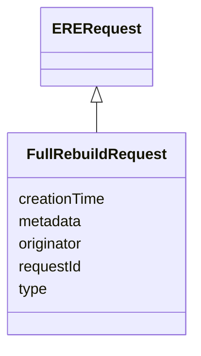

# Class: FullRebuildRequest 


_A request to reset all the resolutions computed so far and rebuild them as _

_requests about old entities arrive again (and build new entities from scratch)._

__

_It is expected that the ERE client re-sends all the entities to be resolved again,_

_using `EntityMentionResolutionRequest` messages exactly as the first time the resolutions _

_were built. This implies the a client like the ERS logs/persists the entities it receives_

_to resolve and also saves manual overriding of ERE results._

__


URI: [ers:FullRebuildRequest](https://data.europa.eu/ers/schema/FullRebuildRequest)





## Inheritance
* [ERERequest](ERERequest.md) [ [ERECommunicationArtefact](ERECommunicationArtefact.md)]
    * **FullRebuildRequest**


## Slots

| Name | Cardinality and Range | Description | Inheritance |
| ---  | --- | --- | --- |
| [requestId](requestId.md) | 1 <br/> [String](String.md) | A string representing the unique ID of this request | [ERERequest](ERERequest.md) |
| [originator](originator.md) | 1 <br/> [String](String.md) | The ID or URI of the request originator | [ERERequest](ERERequest.md) |
| [creationTime](creationTime.md) | 0..1 <br/> [Datetime](Datetime.md) | The timestamp when the request was created | [ERERequest](ERERequest.md) |
| [type](type.md) | 1 <br/> [String](String.md) | The type of the request or result | [ERECommunicationArtefact](ERECommunicationArtefact.md) |
| [metadata](metadata.md) | 0..1 <br/> [String](String.md) | An optional arbitrary dictionary of further request metadata | [ERECommunicationArtefact](ERECommunicationArtefact.md) |


## Identifier and Mapping Information


### Schema Source


* from schema: https://data.europa.eu/ers/schema


## Mappings

| Mapping Type | Mapped Value |
| ---  | ---  |
| self | ers:FullRebuildRequest |
| native | ers:FullRebuildRequest |


## LinkML Source

<!-- TODO: investigate https://stackoverflow.com/questions/37606292/how-to-create-tabbed-code-blocks-in-mkdocs-or-sphinx -->

### Direct

<details>
```yaml
name: FullRebuildRequest
description: "A request to reset all the resolutions computed so far and rebuild them\
  \ as \nrequests about old entities arrive again (and build new entities from scratch).\n\
  \nIt is expected that the ERE client re-sends all the entities to be resolved again,\n\
  using `EntityMentionResolutionRequest` messages exactly as the first time the resolutions\
  \ \nwere built. This implies the a client like the ERS logs/persists the entities\
  \ it receives\nto resolve and also saves manual overriding of ERE results.\n"
from_schema: https://data.europa.eu/ers/schema
is_a: ERERequest

```
</details>

### Induced

<details>
```yaml
name: FullRebuildRequest
description: "A request to reset all the resolutions computed so far and rebuild them\
  \ as \nrequests about old entities arrive again (and build new entities from scratch).\n\
  \nIt is expected that the ERE client re-sends all the entities to be resolved again,\n\
  using `EntityMentionResolutionRequest` messages exactly as the first time the resolutions\
  \ \nwere built. This implies the a client like the ERS logs/persists the entities\
  \ it receives\nto resolve and also saves manual overriding of ERE results.\n"
from_schema: https://data.europa.eu/ers/schema
is_a: ERERequest
attributes:
  requestId:
    name: requestId
    description: 'A string representing the unique ID of this request.

      '
    from_schema: https://data.europa.eu/ers/schema
    rank: 1000
    alias: requestId
    owner: FullRebuildRequest
    domain_of:
    - ERERequest
    - EREResponse
    range: string
    required: true
  originator:
    name: originator
    description: 'The ID or URI of the request originator.

      '
    from_schema: https://data.europa.eu/ers/schema
    rank: 1000
    alias: originator
    owner: FullRebuildRequest
    domain_of:
    - ERERequest
    range: string
    required: true
  creationTime:
    name: creationTime
    description: 'The timestamp when the request was created.

      '
    from_schema: https://data.europa.eu/ers/schema
    rank: 1000
    alias: creationTime
    owner: FullRebuildRequest
    domain_of:
    - ERERequest
    range: datetime
  type:
    name: type
    description: "The type of the request or result.\n\nAs per LinkML specification,\
      \ `designates_type` is used here in order to allow for this\nslot to tell the\
      \ concrete subclass that an instance (such as a JSON object) belongs to.\n\n\
      In other words, a particular request will have `type` set with values like \n\
      `EntityMentionResolutionRequest` or `EntityResolutionResult`\n"
    from_schema: https://data.europa.eu/ers/schema
    rank: 1000
    designates_type: true
    alias: type
    owner: FullRebuildRequest
    domain_of:
    - ERECommunicationArtefact
    - EntityMention
    range: string
    required: true
  metadata:
    name: metadata
    description: 'An optional arbitrary dictionary of further request metadata.

      '
    from_schema: https://data.europa.eu/ers/schema
    rank: 1000
    alias: metadata
    owner: FullRebuildRequest
    domain_of:
    - ERECommunicationArtefact
    range: string

```
</details>