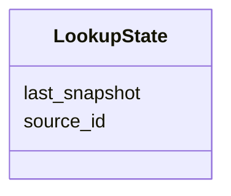

# Class: LookupState 


_Tracks the resolution state for entity mentions from a particular source._

_Records when the source was last resolved against the canonical clustering._

__


URI: [ere:LookupState](https://data.europa.eu/ers/schema/ere/LookupState)





<!-- no inheritance hierarchy -->


## Slots

| Name | Cardinality and Range | Description | Inheritance |
| ---  | --- | --- | --- |
| [source_id](source_id.md) | 1 <br/> [String](String.md) | The ID or URI of the ERS client (originator) for which we track lookup state | direct |
| [last_snapshot](last_snapshot.md) | 1 <br/> [Datetime](Datetime.md) | Timestamp of the last resolution operation for this source | direct |


## Identifier and Mapping Information


### Schema Source


* from schema: https://data.europa.eu/ers/schema/ere


## Mappings

| Mapping Type | Mapped Value |
| ---  | ---  |
| self | ere:LookupState |
| native | ere:LookupState |


## LinkML Source

<!-- TODO: investigate https://stackoverflow.com/questions/37606292/how-to-create-tabbed-code-blocks-in-mkdocs-or-sphinx -->

### Direct

<details>
```yaml
name: LookupState
description: 'Tracks the resolution state for entity mentions from a particular source.

  Records when the source was last resolved against the canonical clustering.

  '
from_schema: https://data.europa.eu/ers/schema/ere
attributes:
  source_id:
    name: source_id
    description: 'The ID or URI of the ERS client (originator) for which we track
      lookup state.

      '
    from_schema: https://data.europa.eu/ers/schema/ers
    domain_of:
    - EntityMentionIdentifier
    - LookupState
    required: true
  last_snapshot:
    name: last_snapshot
    description: 'Timestamp of the last resolution operation for this source.

      Used to determine if a refreshBulk or other update is needed.

      '
    from_schema: https://data.europa.eu/ers/schema/ers
    rank: 1000
    domain_of:
    - LookupState
    range: datetime
    required: true

```
</details>

### Induced

<details>
```yaml
name: LookupState
description: 'Tracks the resolution state for entity mentions from a particular source.

  Records when the source was last resolved against the canonical clustering.

  '
from_schema: https://data.europa.eu/ers/schema/ere
attributes:
  source_id:
    name: source_id
    description: 'The ID or URI of the ERS client (originator) for which we track
      lookup state.

      '
    from_schema: https://data.europa.eu/ers/schema/ers
    alias: source_id
    owner: LookupState
    domain_of:
    - EntityMentionIdentifier
    - LookupState
    range: string
    required: true
  last_snapshot:
    name: last_snapshot
    description: 'Timestamp of the last resolution operation for this source.

      Used to determine if a refreshBulk or other update is needed.

      '
    from_schema: https://data.europa.eu/ers/schema/ers
    rank: 1000
    alias: last_snapshot
    owner: LookupState
    domain_of:
    - LookupState
    range: datetime
    required: true

```
</details>