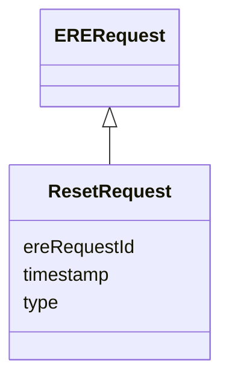

# Class: ResetRequest 


_A request to reset all the resolutions computed so far and possibly rebuild them as _

_requests about old entities arrive again (and build new entities from scratch as usually)._

__

_It is expected that the ERE client re-sends all the entities to be resolved again,_

_using `EntityMentionResolutionRequest` messages exactly as the first time the resolutions _

_were built. This implies the a client like the ERS logs/persists the entities it receives_

_to resolve and also saves manual overriding of ERE results._

__

_Moreover:_

_* The ERE must keep track of past `EntityMention` marked as canonical._

_* The ERE must retain requests with `excludedClusterIds` and apply them again when the _

_  same entity mention is re-sent after the reset. TODO: see notes about this properties,_

_  on the possible need of withdrawing exclusions._

__


URI: [ers:ResetRequest](https://data.europa.eu/ers/schema/ResetRequest)





## Inheritance
* [EREMessage](EREMessage.md)
    * [ERERequest](ERERequest.md)
        * **ResetRequest**


## Slots

| Name | Cardinality and Range | Description | Inheritance |
| ---  | --- | --- | --- |
| [type](type.md) | 1 <br/> [String](String.md) | The type of the request or result | [EREMessage](EREMessage.md) |
| [ereRequestId](ereRequestId.md) | 1 <br/> [String](String.md) | A string representing the unique ID of an ERE request, or the ID of the reque... | [EREMessage](EREMessage.md) |
| [timestamp](timestamp.md) | 0..1 <br/> [Datetime](Datetime.md) | The time when the message was created | [EREMessage](EREMessage.md) |


## Identifier and Mapping Information


### Schema Source


* from schema: https://data.europa.eu/ers/schema


## Mappings

| Mapping Type | Mapped Value |
| ---  | ---  |
| self | ers:ResetRequest |
| native | ers:ResetRequest |


## LinkML Source

<!-- TODO: investigate https://stackoverflow.com/questions/37606292/how-to-create-tabbed-code-blocks-in-mkdocs-or-sphinx -->

### Direct

<details>
```yaml
name: ResetRequest
description: "A request to reset all the resolutions computed so far and possibly\
  \ rebuild them as \nrequests about old entities arrive again (and build new entities\
  \ from scratch as usually).\n\nIt is expected that the ERE client re-sends all the\
  \ entities to be resolved again,\nusing `EntityMentionResolutionRequest` messages\
  \ exactly as the first time the resolutions \nwere built. This implies the a client\
  \ like the ERS logs/persists the entities it receives\nto resolve and also saves\
  \ manual overriding of ERE results.\n\nMoreover:\n* The ERE must keep track of past\
  \ `EntityMention` marked as canonical.\n* The ERE must retain requests with `excludedClusterIds`\
  \ and apply them again when the \n  same entity mention is re-sent after the reset.\
  \ TODO: see notes about this properties,\n  on the possible need of withdrawing\
  \ exclusions.\n"
from_schema: https://data.europa.eu/ers/schema
is_a: ERERequest

```
</details>

### Induced

<details>
```yaml
name: ResetRequest
description: "A request to reset all the resolutions computed so far and possibly\
  \ rebuild them as \nrequests about old entities arrive again (and build new entities\
  \ from scratch as usually).\n\nIt is expected that the ERE client re-sends all the\
  \ entities to be resolved again,\nusing `EntityMentionResolutionRequest` messages\
  \ exactly as the first time the resolutions \nwere built. This implies the a client\
  \ like the ERS logs/persists the entities it receives\nto resolve and also saves\
  \ manual overriding of ERE results.\n\nMoreover:\n* The ERE must keep track of past\
  \ `EntityMention` marked as canonical.\n* The ERE must retain requests with `excludedClusterIds`\
  \ and apply them again when the \n  same entity mention is re-sent after the reset.\
  \ TODO: see notes about this properties,\n  on the possible need of withdrawing\
  \ exclusions.\n"
from_schema: https://data.europa.eu/ers/schema
is_a: ERERequest
attributes:
  type:
    name: type
    description: "The type of the request or result.\n\nAs per LinkML specification,\
      \ `designates_type` is used here in order to allow for this\nslot to tell the\
      \ concrete subclass that an instance (such as a JSON object) belongs to.\n\n\
      In other words, a particular request will have `type` set with values like \n\
      `EntityMentionResolutionRequest` or `EntityResolutionResult`\n"
    from_schema: https://data.europa.eu/ers/schema
    rank: 1000
    designates_type: true
    alias: type
    owner: ResetRequest
    domain_of:
    - EREMessage
    range: string
    required: true
  ereRequestId:
    name: ereRequestId
    description: 'A string representing the unique ID of an ERE request, or the ID
      of the request a response is about.

      This **is not** the same as `requestId` + `sourceId`.

      '
    from_schema: https://data.europa.eu/ers/schema
    rank: 1000
    alias: ereRequestId
    owner: ResetRequest
    domain_of:
    - EREMessage
    range: string
    required: true
  timestamp:
    name: timestamp
    description: 'The time when the message was created. Should be in ISO-8601 format.

      '
    from_schema: https://data.europa.eu/ers/schema
    rank: 1000
    alias: timestamp
    owner: ResetRequest
    domain_of:
    - EREMessage
    range: datetime

```
</details>