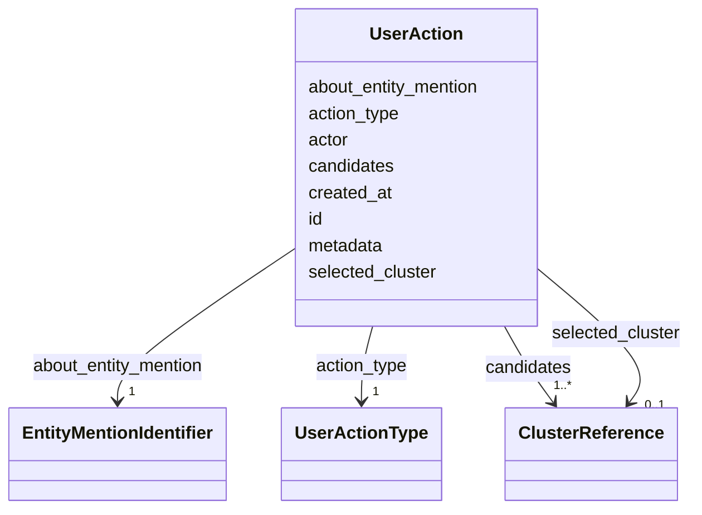

# Class: UserAction 


_Immutable record of a curator action on an entity mention resolution._

_Stored in the User Action Log for traceability and training._

__

_NOT related to ERE messages; represents curator intent only._

__


URI: [ere:UserAction](https://data.europa.eu/ers/schema/ere/UserAction)





<!-- no inheritance hierarchy -->


## Slots

| Name | Cardinality and Range | Description | Inheritance |
| ---  | --- | --- | --- |
| [id](id.md) | 1 <br/> [String](String.md) | Unique audit trail entry identifier | direct |
| [about_entity_mention](about_entity_mention.md) | 1 <br/> [EntityMentionIdentifier](EntityMentionIdentifier.md) | The entity mention the curator acted upon | direct |
| [candidates](candidates.md) | 1..* <br/> [ClusterReference](ClusterReference.md) | The candidate clusters presented to the curator for selection | direct |
| [selected_cluster](selected_cluster.md) | 0..1 <br/> [ClusterReference](ClusterReference.md) | The cluster selected by the curator (if action was ACCEPT_TOP | direct |
| [action_type](action_type.md) | 1 <br/> [UserActionType](UserActionType.md) | The type of action the curator performed | direct |
| [actor](actor.md) | 1 <br/> [String](String.md) | User ID or identifier of the curator who performed the action | direct |
| [created_at](created_at.md) | 1 <br/> [Datetime](Datetime.md) | Timestamp when the curator action was recorded | direct |
| [metadata](metadata.md) | 0..1 <br/> [String](String.md) | JSON metadata providing context (e | direct |


## Identifier and Mapping Information


### Schema Source


* from schema: https://data.europa.eu/ers/schema/ere


## Mappings

| Mapping Type | Mapped Value |
| ---  | ---  |
| self | ere:UserAction |
| native | ere:UserAction |


## LinkML Source

<!-- TODO: investigate https://stackoverflow.com/questions/37606292/how-to-create-tabbed-code-blocks-in-mkdocs-or-sphinx -->

### Direct

<details>
```yaml
name: UserAction
description: 'Immutable record of a curator action on an entity mention resolution.

  Stored in the User Action Log for traceability and training.


  NOT related to ERE messages; represents curator intent only.

  '
from_schema: https://data.europa.eu/ers/schema/ere
attributes:
  id:
    name: id
    description: Unique audit trail entry identifier
    from_schema: https://data.europa.eu/ers/schema/ers
    domain_of:
    - Decision
    - UserAction
    required: true
  about_entity_mention:
    name: about_entity_mention
    description: The entity mention the curator acted upon
    from_schema: https://data.europa.eu/ers/schema/ers
    domain_of:
    - Decision
    - UserAction
    range: EntityMentionIdentifier
    required: true
  candidates:
    name: candidates
    description: 'The candidate clusters presented to the curator for selection.

      Ordered by confidence (same as shown in curation UI).

      '
    from_schema: https://data.europa.eu/ers/schema/ers
    domain_of:
    - EntityMentionResolutionResponse
    - Decision
    - UserAction
    range: ClusterReference
    required: true
    multivalued: true
  selected_cluster:
    name: selected_cluster
    description: 'The cluster selected by the curator (if action was ACCEPT_TOP

      or ACCEPT_ALTERNATIVE). NULL if action was REJECT_ALL.

      '
    from_schema: https://data.europa.eu/ers/schema/ers
    rank: 1000
    domain_of:
    - UserAction
    range: ClusterReference
  action_type:
    name: action_type
    description: The type of action the curator performed
    from_schema: https://data.europa.eu/ers/schema/ers
    rank: 1000
    domain_of:
    - UserAction
    range: UserActionType
    required: true
  actor:
    name: actor
    description: User ID or identifier of the curator who performed the action
    from_schema: https://data.europa.eu/ers/schema/ers
    rank: 1000
    domain_of:
    - UserAction
    required: true
  created_at:
    name: created_at
    description: Timestamp when the curator action was recorded
    from_schema: https://data.europa.eu/ers/schema/ers
    domain_of:
    - Decision
    - UserAction
    range: datetime
    required: true
  metadata:
    name: metadata
    description: 'JSON metadata providing context (e.g., curator notes, reasoning).

      '
    from_schema: https://data.europa.eu/ers/schema/ers
    rank: 1000
    domain_of:
    - UserAction

```
</details>

### Induced

<details>
```yaml
name: UserAction
description: 'Immutable record of a curator action on an entity mention resolution.

  Stored in the User Action Log for traceability and training.


  NOT related to ERE messages; represents curator intent only.

  '
from_schema: https://data.europa.eu/ers/schema/ere
attributes:
  id:
    name: id
    description: Unique audit trail entry identifier
    from_schema: https://data.europa.eu/ers/schema/ers
    alias: id
    owner: UserAction
    domain_of:
    - Decision
    - UserAction
    range: string
    required: true
  about_entity_mention:
    name: about_entity_mention
    description: The entity mention the curator acted upon
    from_schema: https://data.europa.eu/ers/schema/ers
    alias: about_entity_mention
    owner: UserAction
    domain_of:
    - Decision
    - UserAction
    range: EntityMentionIdentifier
    required: true
  candidates:
    name: candidates
    description: 'The candidate clusters presented to the curator for selection.

      Ordered by confidence (same as shown in curation UI).

      '
    from_schema: https://data.europa.eu/ers/schema/ers
    alias: candidates
    owner: UserAction
    domain_of:
    - EntityMentionResolutionResponse
    - Decision
    - UserAction
    range: ClusterReference
    required: true
    multivalued: true
  selected_cluster:
    name: selected_cluster
    description: 'The cluster selected by the curator (if action was ACCEPT_TOP

      or ACCEPT_ALTERNATIVE). NULL if action was REJECT_ALL.

      '
    from_schema: https://data.europa.eu/ers/schema/ers
    rank: 1000
    alias: selected_cluster
    owner: UserAction
    domain_of:
    - UserAction
    range: ClusterReference
  action_type:
    name: action_type
    description: The type of action the curator performed
    from_schema: https://data.europa.eu/ers/schema/ers
    rank: 1000
    alias: action_type
    owner: UserAction
    domain_of:
    - UserAction
    range: UserActionType
    required: true
  actor:
    name: actor
    description: User ID or identifier of the curator who performed the action
    from_schema: https://data.europa.eu/ers/schema/ers
    rank: 1000
    alias: actor
    owner: UserAction
    domain_of:
    - UserAction
    range: string
    required: true
  created_at:
    name: created_at
    description: Timestamp when the curator action was recorded
    from_schema: https://data.europa.eu/ers/schema/ers
    alias: created_at
    owner: UserAction
    domain_of:
    - Decision
    - UserAction
    range: datetime
    required: true
  metadata:
    name: metadata
    description: 'JSON metadata providing context (e.g., curator notes, reasoning).

      '
    from_schema: https://data.europa.eu/ers/schema/ers
    rank: 1000
    alias: metadata
    owner: UserAction
    domain_of:
    - UserAction
    range: string

```
</details>