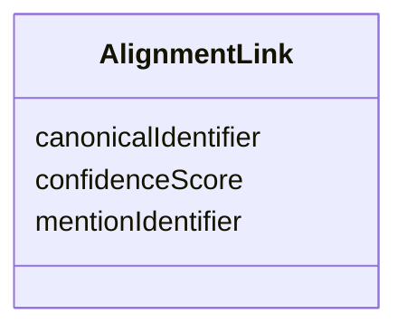

# Class: AlignmentLink 


_Represents either manual or automatic alignment. It can be also used to represent uncertain automatic alignments. Note:Uncertain automatic alignments will be used in the web curation app to show alternative alignments, but they'll never be used as a "primary" link provided for link curation._


URI: [ers:AlignmentLink](ers:AlignmentLink)





<!-- no inheritance hierarchy -->


## Slots

| Name | Cardinality and Range | Description | Inheritance |
| ---  | --- | --- | --- |
| [mentionIdentifier](mentionIdentifier.md) | 1 <br/> [Uri](Uri.md) |  | direct |
| [canonicalIdentifier](canonicalIdentifier.md) | 1 <br/> [Uri](Uri.md) |  | direct |
| [confidenceScore](confidenceScore.md) | 1 <br/> [Double](Double.md) | This indicates a confidence of belonging to a cluster:0 - 1 :automatically co... | direct |


## Usages

| used by | used in | type | used |
| ---  | --- | --- | --- |
| [AlignmentLinkSet](AlignmentLinkSet.md) | [alignmentOption](alignmentOption.md) | range | [AlignmentLink](AlignmentLink.md) |
| [AlignmentLinkSet](AlignmentLinkSet.md) | [defaultAlignment](defaultAlignment.md) | range | [AlignmentLink](AlignmentLink.md) |
| [CanonicalEntity](CanonicalEntity.md) | [mentionLink](mentionLink.md) | range | [AlignmentLink](AlignmentLink.md) |
| [Decission](Decission.md) | [acceptedAlignment](acceptedAlignment.md) | range | [AlignmentLink](AlignmentLink.md) |
| [Decission](Decission.md) | [acceptedLink](acceptedLink.md) | range | [AlignmentLink](AlignmentLink.md) |
| [Decission](Decission.md) | [chosenAlternativeLink](chosenAlternativeLink.md) | range | [AlignmentLink](AlignmentLink.md) |


## Identifier and Mapping Information


### Schema Source


* from schema: http://publications.europa.eu/ontology/ers


## Mappings

| Mapping Type | Mapped Value |
| ---  | ---  |
| self | ers:AlignmentLink |
| native | http://publications.europa.eu/ontology/ers/AlignmentLink |


## LinkML Source

<!-- TODO: investigate https://stackoverflow.com/questions/37606292/how-to-create-tabbed-code-blocks-in-mkdocs-or-sphinx -->

### Direct

<details>
```yaml
name: AlignmentLink
description: Represents either manual or automatic alignment. It can be also used
  to represent uncertain automatic alignments. Note:Uncertain automatic alignments
  will be used in the web curation app to show alternative alignments, but they'll
  never be used as a "primary" link provided for link curation.
from_schema: http://publications.europa.eu/ontology/ers
attributes:
  mentionIdentifier:
    name: mentionIdentifier
    from_schema: http://publications.europa.eu/ontology/ers
    rank: 1000
    slot_uri: ers:mentionIdentifier
    domain_of:
    - AlignmentLink
    range: uri
    required: true
    multivalued: false
  canonicalIdentifier:
    name: canonicalIdentifier
    from_schema: http://publications.europa.eu/ontology/ers
    rank: 1000
    slot_uri: ers:canonicalIdentifier
    domain_of:
    - AlignmentLink
    range: uri
    required: true
    multivalued: false
  confidenceScore:
    name: confidenceScore
    description: This indicates a confidence of belonging to a cluster:0 - 1 :automatically
      computed -1 :rejected by a person
    from_schema: http://publications.europa.eu/ontology/ers
    rank: 1000
    slot_uri: ers:confidenceScore
    domain_of:
    - AlignmentLink
    range: double
    required: true
    multivalued: false
class_uri: ers:AlignmentLink

```
</details>

### Induced

<details>
```yaml
name: AlignmentLink
description: Represents either manual or automatic alignment. It can be also used
  to represent uncertain automatic alignments. Note:Uncertain automatic alignments
  will be used in the web curation app to show alternative alignments, but they'll
  never be used as a "primary" link provided for link curation.
from_schema: http://publications.europa.eu/ontology/ers
attributes:
  mentionIdentifier:
    name: mentionIdentifier
    from_schema: http://publications.europa.eu/ontology/ers
    rank: 1000
    slot_uri: ers:mentionIdentifier
    alias: mentionIdentifier
    owner: AlignmentLink
    domain_of:
    - AlignmentLink
    range: uri
    required: true
    multivalued: false
  canonicalIdentifier:
    name: canonicalIdentifier
    from_schema: http://publications.europa.eu/ontology/ers
    rank: 1000
    slot_uri: ers:canonicalIdentifier
    alias: canonicalIdentifier
    owner: AlignmentLink
    domain_of:
    - AlignmentLink
    range: uri
    required: true
    multivalued: false
  confidenceScore:
    name: confidenceScore
    description: This indicates a confidence of belonging to a cluster:0 - 1 :automatically
      computed -1 :rejected by a person
    from_schema: http://publications.europa.eu/ontology/ers
    rank: 1000
    slot_uri: ers:confidenceScore
    alias: confidenceScore
    owner: AlignmentLink
    domain_of:
    - AlignmentLink
    range: double
    required: true
    multivalued: false
class_uri: ers:AlignmentLink

```
</details>