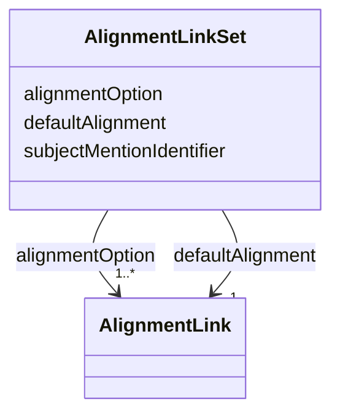

# Class: AlignmentLinkSet 


_The alignment link set is a collection of alignment links that form a set of possible alignments for the same entity. Usually the link set serves as a decision context defined by the alternative alignment links automatically derived. Then it is called a DecisionContext. In addition, to make a decission in the UI, it is necessary to access the entity representation, and the canonical entities representations. Note:There is no distinction between the main (canonical) and alternative (potential) alignments. This is determined by the confidence score (link with the highest score links to the canonical entity). Optionally, the list can be sorted by score in descending order._


URI: [ers:AlignmentLinkSet](ers:AlignmentLinkSet)





<!-- no inheritance hierarchy -->


## Slots

| Name | Cardinality and Range | Description | Inheritance |
| ---  | --- | --- | --- |
| [subjectMentionIdentifier](subjectMentionIdentifier.md) | 1 <br/> [Uri](Uri.md) |  | direct |
| [alignmentOption](alignmentOption.md) | 1..* <br/> [AlignmentLink](AlignmentLink.md) |  | direct |
| [defaultAlignment](defaultAlignment.md) | 1 <br/> [AlignmentLink](AlignmentLink.md) |  | direct |


## Usages

| used by | used in | type | used |
| ---  | --- | --- | --- |
| [Decission](Decission.md) | [decisionContext](decisionContext.md) | range | [AlignmentLinkSet](AlignmentLinkSet.md) |


## Identifier and Mapping Information


### Schema Source


* from schema: http://publications.europa.eu/ontology/ers


## Mappings

| Mapping Type | Mapped Value |
| ---  | ---  |
| self | ers:AlignmentLinkSet |
| native | http://publications.europa.eu/ontology/ers/AlignmentLinkSet |


## LinkML Source

<!-- TODO: investigate https://stackoverflow.com/questions/37606292/how-to-create-tabbed-code-blocks-in-mkdocs-or-sphinx -->

### Direct

<details>
```yaml
name: AlignmentLinkSet
description: The alignment link set is a collection of alignment links that form a
  set of possible alignments for the same entity. Usually the link set serves as a
  decision context defined by the alternative alignment links automatically derived.
  Then it is called a DecisionContext. In addition, to make a decission in the UI,
  it is necessary to access the entity representation, and the canonical entities
  representations. Note:There is no distinction between the main (canonical) and alternative
  (potential) alignments. This is determined by the confidence score (link with the
  highest score links to the canonical entity). Optionally, the list can be sorted
  by score in descending order.
from_schema: http://publications.europa.eu/ontology/ers
attributes:
  subjectMentionIdentifier:
    name: subjectMentionIdentifier
    from_schema: http://publications.europa.eu/ontology/ers
    rank: 1000
    slot_uri: ers:subjectMentionIdentifier
    domain_of:
    - AlignmentLinkSet
    range: uri
    required: true
    multivalued: false
  alignmentOption:
    name: alignmentOption
    from_schema: http://publications.europa.eu/ontology/ers
    rank: 1000
    slot_uri: ers:alignmentOption
    domain_of:
    - AlignmentLinkSet
    range: AlignmentLink
    required: true
    multivalued: true
  defaultAlignment:
    name: defaultAlignment
    from_schema: http://publications.europa.eu/ontology/ers
    rank: 1000
    slot_uri: ers:defaultAlignment
    domain_of:
    - AlignmentLinkSet
    range: AlignmentLink
    required: true
    multivalued: false
class_uri: ers:AlignmentLinkSet

```
</details>

### Induced

<details>
```yaml
name: AlignmentLinkSet
description: The alignment link set is a collection of alignment links that form a
  set of possible alignments for the same entity. Usually the link set serves as a
  decision context defined by the alternative alignment links automatically derived.
  Then it is called a DecisionContext. In addition, to make a decission in the UI,
  it is necessary to access the entity representation, and the canonical entities
  representations. Note:There is no distinction between the main (canonical) and alternative
  (potential) alignments. This is determined by the confidence score (link with the
  highest score links to the canonical entity). Optionally, the list can be sorted
  by score in descending order.
from_schema: http://publications.europa.eu/ontology/ers
attributes:
  subjectMentionIdentifier:
    name: subjectMentionIdentifier
    from_schema: http://publications.europa.eu/ontology/ers
    rank: 1000
    slot_uri: ers:subjectMentionIdentifier
    alias: subjectMentionIdentifier
    owner: AlignmentLinkSet
    domain_of:
    - AlignmentLinkSet
    range: uri
    required: true
    multivalued: false
  alignmentOption:
    name: alignmentOption
    from_schema: http://publications.europa.eu/ontology/ers
    rank: 1000
    slot_uri: ers:alignmentOption
    alias: alignmentOption
    owner: AlignmentLinkSet
    domain_of:
    - AlignmentLinkSet
    range: AlignmentLink
    required: true
    multivalued: true
  defaultAlignment:
    name: defaultAlignment
    from_schema: http://publications.europa.eu/ontology/ers
    rank: 1000
    slot_uri: ers:defaultAlignment
    alias: defaultAlignment
    owner: AlignmentLinkSet
    domain_of:
    - AlignmentLinkSet
    range: AlignmentLink
    required: true
    multivalued: false
class_uri: ers:AlignmentLinkSet

```
</details>