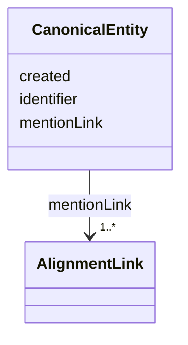

# Class: CanonicalEntity 


_No two links can exist for the same entity mention within the entire store. The alignment links MUST be to distinct entity mentions._


URI: [ers:CanonicalEntity](ers:CanonicalEntity)





<!-- no inheritance hierarchy -->


## Slots

| Name | Cardinality and Range | Description | Inheritance |
| ---  | --- | --- | --- |
| [identifier](identifier.md) | 1 <br/> [Uri](Uri.md) |  | direct |
| [created](created.md) | 1 <br/> [Datetime](Datetime.md) |  | direct |
| [mentionLink](mentionLink.md) | 1..* <br/> [AlignmentLink](AlignmentLink.md) |  | direct |


## Usages

| used by | used in | type | used |
| ---  | --- | --- | --- |
| [CanonicalEntityRegistry](CanonicalEntityRegistry.md) | [canonicalEntity](canonicalEntity.md) | range | [CanonicalEntity](CanonicalEntity.md) |


## Identifier and Mapping Information


### Schema Source


* from schema: http://publications.europa.eu/ontology/ers


## Mappings

| Mapping Type | Mapped Value |
| ---  | ---  |
| self | ers:CanonicalEntity |
| native | http://publications.europa.eu/ontology/ers/CanonicalEntity |


## LinkML Source

<!-- TODO: investigate https://stackoverflow.com/questions/37606292/how-to-create-tabbed-code-blocks-in-mkdocs-or-sphinx -->

### Direct

<details>
```yaml
name: CanonicalEntity
description: No two links can exist for the same entity mention within the entire
  store. The alignment links MUST be to distinct entity mentions.
from_schema: http://publications.europa.eu/ontology/ers
attributes:
  identifier:
    name: identifier
    from_schema: http://publications.europa.eu/ontology/ers
    rank: 1000
    slot_uri: ers:identifier
    domain_of:
    - CanonicalEntity
    - EntityMention
    range: uri
    required: true
    multivalued: false
  created:
    name: created
    from_schema: http://publications.europa.eu/ontology/ers
    rank: 1000
    slot_uri: ers:created
    domain_of:
    - CanonicalEntity
    - RequestRecord
    range: datetime
    required: true
    multivalued: false
  mentionLink:
    name: mentionLink
    from_schema: http://publications.europa.eu/ontology/ers
    rank: 1000
    slot_uri: ers:mentionLink
    domain_of:
    - CanonicalEntity
    range: AlignmentLink
    required: true
    multivalued: true
class_uri: ers:CanonicalEntity

```
</details>

### Induced

<details>
```yaml
name: CanonicalEntity
description: No two links can exist for the same entity mention within the entire
  store. The alignment links MUST be to distinct entity mentions.
from_schema: http://publications.europa.eu/ontology/ers
attributes:
  identifier:
    name: identifier
    from_schema: http://publications.europa.eu/ontology/ers
    rank: 1000
    slot_uri: ers:identifier
    alias: identifier
    owner: CanonicalEntity
    domain_of:
    - CanonicalEntity
    - EntityMention
    range: uri
    required: true
    multivalued: false
  created:
    name: created
    from_schema: http://publications.europa.eu/ontology/ers
    rank: 1000
    slot_uri: ers:created
    alias: created
    owner: CanonicalEntity
    domain_of:
    - CanonicalEntity
    - RequestRecord
    range: datetime
    required: true
    multivalued: false
  mentionLink:
    name: mentionLink
    from_schema: http://publications.europa.eu/ontology/ers
    rank: 1000
    slot_uri: ers:mentionLink
    alias: mentionLink
    owner: CanonicalEntity
    domain_of:
    - CanonicalEntity
    range: AlignmentLink
    required: true
    multivalued: true
class_uri: ers:CanonicalEntity

```
</details>