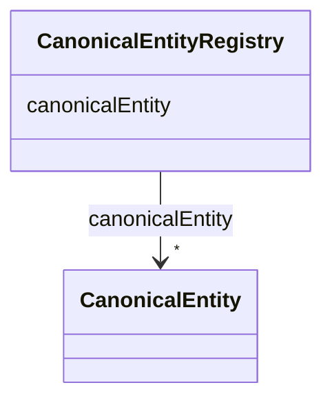

# Class: CanonicalEntityRegistry 


URI: [ers:CanonicalEntityRegistry](ers:CanonicalEntityRegistry)





<!-- no inheritance hierarchy -->


## Slots

| Name | Cardinality and Range | Description | Inheritance |
| ---  | --- | --- | --- |
| [canonicalEntity](canonicalEntity.md) | * <br/> [CanonicalEntity](CanonicalEntity.md) |  | direct |


## Identifier and Mapping Information


### Schema Source


* from schema: http://publications.europa.eu/ontology/ers


## Mappings

| Mapping Type | Mapped Value |
| ---  | ---  |
| self | ers:CanonicalEntityRegistry |
| native | http://publications.europa.eu/ontology/ers/CanonicalEntityRegistry |


## LinkML Source

<!-- TODO: investigate https://stackoverflow.com/questions/37606292/how-to-create-tabbed-code-blocks-in-mkdocs-or-sphinx -->

### Direct

<details>
```yaml
name: CanonicalEntityRegistry
from_schema: http://publications.europa.eu/ontology/ers
attributes:
  canonicalEntity:
    name: canonicalEntity
    from_schema: http://publications.europa.eu/ontology/ers
    rank: 1000
    slot_uri: ers:canonicalEntity
    domain_of:
    - CanonicalEntityRegistry
    range: CanonicalEntity
    required: false
    multivalued: true
class_uri: ers:CanonicalEntityRegistry

```
</details>

### Induced

<details>
```yaml
name: CanonicalEntityRegistry
from_schema: http://publications.europa.eu/ontology/ers
attributes:
  canonicalEntity:
    name: canonicalEntity
    from_schema: http://publications.europa.eu/ontology/ers
    rank: 1000
    slot_uri: ers:canonicalEntity
    alias: canonicalEntity
    owner: CanonicalEntityRegistry
    domain_of:
    - CanonicalEntityRegistry
    range: CanonicalEntity
    required: false
    multivalued: true
class_uri: ers:CanonicalEntityRegistry

```
</details>