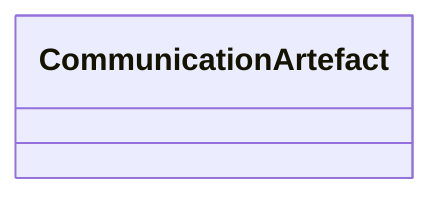

# Class: CommunicationArtefact 


URI: [ers:CommunicationArtefact](ers:CommunicationArtefact)





<!-- no inheritance hierarchy -->


## Slots

| Name | Cardinality and Range | Description | Inheritance |
| ---  | --- | --- | --- |


## Identifier and Mapping Information


### Schema Source


* from schema: http://publications.europa.eu/ontology/ers


## Mappings

| Mapping Type | Mapped Value |
| ---  | ---  |
| self | ers:CommunicationArtefact |
| native | http://publications.europa.eu/ontology/ers/CommunicationArtefact |


## LinkML Source

<!-- TODO: investigate https://stackoverflow.com/questions/37606292/how-to-create-tabbed-code-blocks-in-mkdocs-or-sphinx -->

### Direct

<details>
```yaml
name: CommunicationArtefact
from_schema: http://publications.europa.eu/ontology/ers
class_uri: ers:CommunicationArtefact

```
</details>

### Induced

<details>
```yaml
name: CommunicationArtefact
from_schema: http://publications.europa.eu/ontology/ers
class_uri: ers:CommunicationArtefact

```
</details>