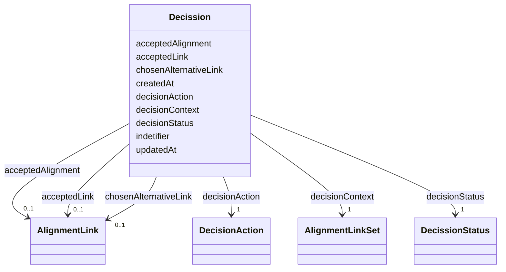

# Class: Decission 


_The decision object captures what (integration) action shall be taken given a DeciusionContex. Integration needed in 2 context when a response comes from ERE , we need to (step 1) store the alternatives + (step 2) automatically accept the top alternative if it is above and (step 3) upsert it into the canonical entity registry For automated actions ... For user actions ... The decision-making integration logic is as follows:1) Accepting the automatic alignment confidenceScore of the proposed alignment is left as is. 2) Reassigning the mention to another proposed entity confidenceScore of the chosen alignment is set to 1.0 confidenceScore of the proposed alignment is set to -1.0 other alternative alignments are note affected 2) Rejecting the automatic alignment confidenceScore of both proposed alignment and alternative alignments is set to -1.0_


URI: [ers:Decission](ers:Decission)





<!-- no inheritance hierarchy -->


## Slots

| Name | Cardinality and Range | Description | Inheritance |
| ---  | --- | --- | --- |
| [indetifier](indetifier.md) | 1 <br/> [Uri](Uri.md) |  | direct |
| [createdAt](createdAt.md) | 1 <br/> [Datetime](Datetime.md) |  | direct |
| [updatedAt](updatedAt.md) | 1 <br/> [Datetime](Datetime.md) |  | direct |
| [acceptedAlignment](acceptedAlignment.md) | 0..1 <br/> [AlignmentLink](AlignmentLink.md) |  | direct |
| [acceptedLink](acceptedLink.md) | 0..1 <br/> [AlignmentLink](AlignmentLink.md) |  | direct |
| [chosenAlternativeLink](chosenAlternativeLink.md) | 0..1 <br/> [AlignmentLink](AlignmentLink.md) |  | direct |
| [decisionContext](decisionContext.md) | 1 <br/> [AlignmentLinkSet](AlignmentLinkSet.md) |  | direct |
| [decisionStatus](decisionStatus.md) | 1 <br/> [DecissionStatus](DecissionStatus.md) |  | direct |
| [decisionAction](decisionAction.md) | 1 <br/> [DecisionAction](DecisionAction.md) |  | direct |


## Usages

| used by | used in | type | used |
| ---  | --- | --- | --- |
| [DecissionsStore](DecissionsStore.md) | [decision](decision.md) | range | [Decission](Decission.md) |


## Identifier and Mapping Information


### Schema Source


* from schema: http://publications.europa.eu/ontology/ers


## Mappings

| Mapping Type | Mapped Value |
| ---  | ---  |
| self | ers:Decission |
| native | http://publications.europa.eu/ontology/ers/Decission |


## LinkML Source

<!-- TODO: investigate https://stackoverflow.com/questions/37606292/how-to-create-tabbed-code-blocks-in-mkdocs-or-sphinx -->

### Direct

<details>
```yaml
name: Decission
description: The decision object captures what (integration) action shall be taken
  given a DeciusionContex. Integration needed in 2 context when a response comes from
  ERE , we need to (step 1) store the alternatives + (step 2) automatically accept
  the top alternative if it is above and (step 3) upsert it into the canonical entity
  registry For automated actions ... For user actions ... The decision-making integration
  logic is as follows:1) Accepting the automatic alignment confidenceScore of the
  proposed alignment is left as is. 2) Reassigning the mention to another proposed
  entity confidenceScore of the chosen alignment is set to 1.0 confidenceScore of
  the proposed alignment is set to -1.0 other alternative alignments are note affected
  2) Rejecting the automatic alignment confidenceScore of both proposed alignment
  and alternative alignments is set to -1.0
from_schema: http://publications.europa.eu/ontology/ers
attributes:
  indetifier:
    name: indetifier
    from_schema: http://publications.europa.eu/ontology/ers
    rank: 1000
    slot_uri: ers:indetifier
    domain_of:
    - Decission
    range: uri
    required: true
    multivalued: false
  createdAt:
    name: createdAt
    from_schema: http://publications.europa.eu/ontology/ers
    rank: 1000
    slot_uri: ers:createdAt
    domain_of:
    - Decission
    range: datetime
    required: true
    multivalued: false
  updatedAt:
    name: updatedAt
    from_schema: http://publications.europa.eu/ontology/ers
    rank: 1000
    slot_uri: ers:updatedAt
    domain_of:
    - Decission
    range: datetime
    required: true
    multivalued: false
  acceptedAlignment:
    name: acceptedAlignment
    from_schema: http://publications.europa.eu/ontology/ers
    rank: 1000
    slot_uri: acceptedAlignment
    domain_of:
    - Decission
    range: AlignmentLink
    required: false
    multivalued: false
  acceptedLink:
    name: acceptedLink
    from_schema: http://publications.europa.eu/ontology/ers
    rank: 1000
    slot_uri: ers:acceptedLink
    domain_of:
    - Decission
    range: AlignmentLink
    required: false
    multivalued: false
  chosenAlternativeLink:
    name: chosenAlternativeLink
    from_schema: http://publications.europa.eu/ontology/ers
    rank: 1000
    slot_uri: chosenAlternativeLink
    domain_of:
    - Decission
    range: AlignmentLink
    required: false
    multivalued: false
  decisionContext:
    name: decisionContext
    from_schema: http://publications.europa.eu/ontology/ers
    rank: 1000
    slot_uri: ers:decisionContext
    domain_of:
    - Decission
    range: AlignmentLinkSet
    required: true
    multivalued: false
  decisionStatus:
    name: decisionStatus
    from_schema: http://publications.europa.eu/ontology/ers
    rank: 1000
    slot_uri: ers:decisionStatus
    domain_of:
    - Decission
    range: DecissionStatus
    required: true
    multivalued: false
  decisionAction:
    name: decisionAction
    from_schema: http://publications.europa.eu/ontology/ers
    rank: 1000
    slot_uri: ers:decisionAction
    domain_of:
    - Decission
    range: DecisionAction
    required: true
    multivalued: false
class_uri: ers:Decission

```
</details>

### Induced

<details>
```yaml
name: Decission
description: The decision object captures what (integration) action shall be taken
  given a DeciusionContex. Integration needed in 2 context when a response comes from
  ERE , we need to (step 1) store the alternatives + (step 2) automatically accept
  the top alternative if it is above and (step 3) upsert it into the canonical entity
  registry For automated actions ... For user actions ... The decision-making integration
  logic is as follows:1) Accepting the automatic alignment confidenceScore of the
  proposed alignment is left as is. 2) Reassigning the mention to another proposed
  entity confidenceScore of the chosen alignment is set to 1.0 confidenceScore of
  the proposed alignment is set to -1.0 other alternative alignments are note affected
  2) Rejecting the automatic alignment confidenceScore of both proposed alignment
  and alternative alignments is set to -1.0
from_schema: http://publications.europa.eu/ontology/ers
attributes:
  indetifier:
    name: indetifier
    from_schema: http://publications.europa.eu/ontology/ers
    rank: 1000
    slot_uri: ers:indetifier
    alias: indetifier
    owner: Decission
    domain_of:
    - Decission
    range: uri
    required: true
    multivalued: false
  createdAt:
    name: createdAt
    from_schema: http://publications.europa.eu/ontology/ers
    rank: 1000
    slot_uri: ers:createdAt
    alias: createdAt
    owner: Decission
    domain_of:
    - Decission
    range: datetime
    required: true
    multivalued: false
  updatedAt:
    name: updatedAt
    from_schema: http://publications.europa.eu/ontology/ers
    rank: 1000
    slot_uri: ers:updatedAt
    alias: updatedAt
    owner: Decission
    domain_of:
    - Decission
    range: datetime
    required: true
    multivalued: false
  acceptedAlignment:
    name: acceptedAlignment
    from_schema: http://publications.europa.eu/ontology/ers
    rank: 1000
    slot_uri: acceptedAlignment
    alias: acceptedAlignment
    owner: Decission
    domain_of:
    - Decission
    range: AlignmentLink
    required: false
    multivalued: false
  acceptedLink:
    name: acceptedLink
    from_schema: http://publications.europa.eu/ontology/ers
    rank: 1000
    slot_uri: ers:acceptedLink
    alias: acceptedLink
    owner: Decission
    domain_of:
    - Decission
    range: AlignmentLink
    required: false
    multivalued: false
  chosenAlternativeLink:
    name: chosenAlternativeLink
    from_schema: http://publications.europa.eu/ontology/ers
    rank: 1000
    slot_uri: chosenAlternativeLink
    alias: chosenAlternativeLink
    owner: Decission
    domain_of:
    - Decission
    range: AlignmentLink
    required: false
    multivalued: false
  decisionContext:
    name: decisionContext
    from_schema: http://publications.europa.eu/ontology/ers
    rank: 1000
    slot_uri: ers:decisionContext
    alias: decisionContext
    owner: Decission
    domain_of:
    - Decission
    range: AlignmentLinkSet
    required: true
    multivalued: false
  decisionStatus:
    name: decisionStatus
    from_schema: http://publications.europa.eu/ontology/ers
    rank: 1000
    slot_uri: ers:decisionStatus
    alias: decisionStatus
    owner: Decission
    domain_of:
    - Decission
    range: DecissionStatus
    required: true
    multivalued: false
  decisionAction:
    name: decisionAction
    from_schema: http://publications.europa.eu/ontology/ers
    rank: 1000
    slot_uri: ers:decisionAction
    alias: decisionAction
    owner: Decission
    domain_of:
    - Decission
    range: DecisionAction
    required: true
    multivalued: false
class_uri: ers:Decission

```
</details>