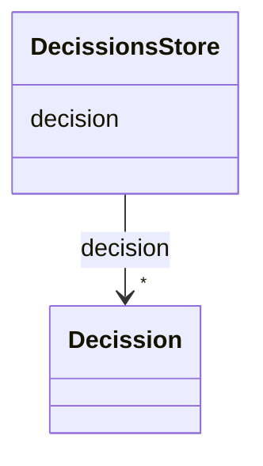

# Class: DecissionsStore 


_Working store Stores data for knowing the choice context training machine learning models_


URI: [ers:DecissionsStore](ers:DecissionsStore)





<!-- no inheritance hierarchy -->


## Slots

| Name | Cardinality and Range | Description | Inheritance |
| ---  | --- | --- | --- |
| [decision](decision.md) | * <br/> [Decission](Decission.md) |  | direct |


## Identifier and Mapping Information


### Schema Source


* from schema: http://publications.europa.eu/ontology/ers


## Mappings

| Mapping Type | Mapped Value |
| ---  | ---  |
| self | ers:DecissionsStore |
| native | http://publications.europa.eu/ontology/ers/DecissionsStore |


## LinkML Source

<!-- TODO: investigate https://stackoverflow.com/questions/37606292/how-to-create-tabbed-code-blocks-in-mkdocs-or-sphinx -->

### Direct

<details>
```yaml
name: DecissionsStore
description: Working store Stores data for knowing the choice context training machine
  learning models
from_schema: http://publications.europa.eu/ontology/ers
attributes:
  decision:
    name: decision
    from_schema: http://publications.europa.eu/ontology/ers
    rank: 1000
    slot_uri: ers:decision
    domain_of:
    - DecissionsStore
    range: Decission
    required: false
    multivalued: true
class_uri: ers:DecissionsStore

```
</details>

### Induced

<details>
```yaml
name: DecissionsStore
description: Working store Stores data for knowing the choice context training machine
  learning models
from_schema: http://publications.europa.eu/ontology/ers
attributes:
  decision:
    name: decision
    from_schema: http://publications.europa.eu/ontology/ers
    rank: 1000
    slot_uri: ers:decision
    alias: decision
    owner: DecissionsStore
    domain_of:
    - DecissionsStore
    range: Decission
    required: false
    multivalued: true
class_uri: ers:DecissionsStore

```
</details>