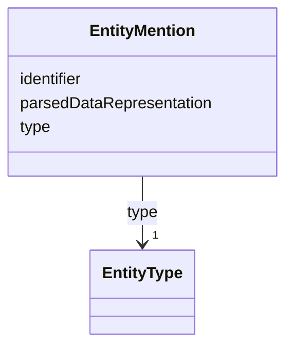

# Class: EntityMention 


URI: [ers:EntityMention](ers:EntityMention)





<!-- no inheritance hierarchy -->


## Slots

| Name | Cardinality and Range | Description | Inheritance |
| ---  | --- | --- | --- |
| [identifier](identifier.md) | 1 <br/> [Uri](Uri.md) | Derived by a direct transformation/computing of available fields | direct |
| [parsedDataRepresentation](parsedDataRepresentation.md) | 1 <br/> [String](String.md) | data are parsed/computed before storage in the ERS | direct |
| [type](type.md) | 1 <br/> [EntityType](EntityType.md) |  | direct |


## Usages

| used by | used in | type | used |
| ---  | --- | --- | --- |
| [RequestRecord](RequestRecord.md) | [entityMention](entityMention.md) | range | [EntityMention](EntityMention.md) |


## Identifier and Mapping Information


### Schema Source


* from schema: http://publications.europa.eu/ontology/ers


## Mappings

| Mapping Type | Mapped Value |
| ---  | ---  |
| self | ers:EntityMention |
| native | http://publications.europa.eu/ontology/ers/EntityMention |


## LinkML Source

<!-- TODO: investigate https://stackoverflow.com/questions/37606292/how-to-create-tabbed-code-blocks-in-mkdocs-or-sphinx -->

### Direct

<details>
```yaml
name: EntityMention
from_schema: http://publications.europa.eu/ontology/ers
attributes:
  identifier:
    name: identifier
    description: Derived by a direct transformation/computing of available fields.
      Derived from the payload, i.e. getting the URI of the entityMention RDF payload.
      The ID is minted by the system, based on directly deriving it from the request
      ID + originator ID.
    from_schema: http://publications.europa.eu/ontology/ers
    slot_uri: ers:identifier
    domain_of:
    - CanonicalEntity
    - EntityMention
    range: uri
    required: true
    multivalued: false
  parsedDataRepresentation:
    name: parsedDataRepresentation
    description: data are parsed/computed before storage in the ERS. Note:this could
      be lazy parsing because it is only for LinkCuration.
    from_schema: http://publications.europa.eu/ontology/ers
    rank: 1000
    slot_uri: ers:parsedDataRepresentation
    domain_of:
    - EntityMention
    range: string
    required: true
    multivalued: false
  type:
    name: type
    from_schema: http://publications.europa.eu/ontology/ers
    rank: 1000
    slot_uri: ers:type
    domain_of:
    - EntityMention
    - RequestRecord
    range: EntityType
    required: true
    multivalued: false
class_uri: ers:EntityMention

```
</details>

### Induced

<details>
```yaml
name: EntityMention
from_schema: http://publications.europa.eu/ontology/ers
attributes:
  identifier:
    name: identifier
    description: Derived by a direct transformation/computing of available fields.
      Derived from the payload, i.e. getting the URI of the entityMention RDF payload.
      The ID is minted by the system, based on directly deriving it from the request
      ID + originator ID.
    from_schema: http://publications.europa.eu/ontology/ers
    slot_uri: ers:identifier
    alias: identifier
    owner: EntityMention
    domain_of:
    - CanonicalEntity
    - EntityMention
    range: uri
    required: true
    multivalued: false
  parsedDataRepresentation:
    name: parsedDataRepresentation
    description: data are parsed/computed before storage in the ERS. Note:this could
      be lazy parsing because it is only for LinkCuration.
    from_schema: http://publications.europa.eu/ontology/ers
    rank: 1000
    slot_uri: ers:parsedDataRepresentation
    alias: parsedDataRepresentation
    owner: EntityMention
    domain_of:
    - EntityMention
    range: string
    required: true
    multivalued: false
  type:
    name: type
    from_schema: http://publications.europa.eu/ontology/ers
    rank: 1000
    slot_uri: ers:type
    alias: type
    owner: EntityMention
    domain_of:
    - EntityMention
    - RequestRecord
    range: EntityType
    required: true
    multivalued: false
class_uri: ers:EntityMention

```
</details>