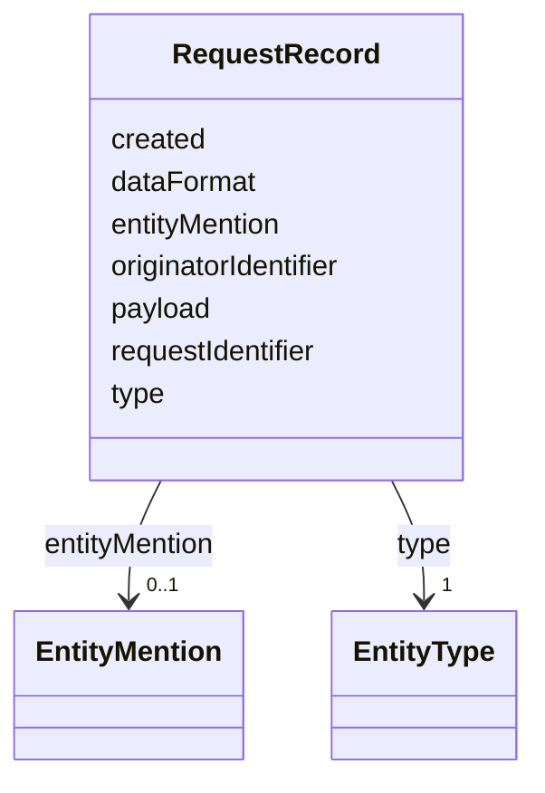

# Class: RequestRecord 


_This is stored in the system of records._


URI: [ers:RequestRecord](ers:RequestRecord)





<!-- no inheritance hierarchy -->


## Slots

| Name | Cardinality and Range | Description | Inheritance |
| ---  | --- | --- | --- |
| [requestIdentifier](requestIdentifier.md) | 1 <br/> [Uri](Uri.md) |  | direct |
| [originatorIdentifier](originatorIdentifier.md) | 1 <br/> [Uri](Uri.md) |  | direct |
| [created](created.md) | 1 <br/> [Datetime](Datetime.md) |  | direct |
| [dataFormat](dataFormat.md) | 1 <br/> [String](String.md) |  | direct |
| [payload](payload.md) | 1 <br/> [String](String.md) |  | direct |
| [entityMention](entityMention.md) | 0..1 <br/> [EntityMention](EntityMention.md) |  | direct |
| [type](type.md) | 1 <br/> [EntityType](EntityType.md) |  | direct |


## Usages

| used by | used in | type | used |
| ---  | --- | --- | --- |
| [SystemOfRequestRecords](SystemOfRequestRecords.md) | [record](record.md) | range | [RequestRecord](RequestRecord.md) |


## Identifier and Mapping Information


### Schema Source


* from schema: http://publications.europa.eu/ontology/ers


## Mappings

| Mapping Type | Mapped Value |
| ---  | ---  |
| self | ers:RequestRecord |
| native | http://publications.europa.eu/ontology/ers/RequestRecord |


## LinkML Source

<!-- TODO: investigate https://stackoverflow.com/questions/37606292/how-to-create-tabbed-code-blocks-in-mkdocs-or-sphinx -->

### Direct

<details>
```yaml
name: RequestRecord
description: This is stored in the system of records.
from_schema: http://publications.europa.eu/ontology/ers
attributes:
  requestIdentifier:
    name: requestIdentifier
    from_schema: http://publications.europa.eu/ontology/ers
    rank: 1000
    slot_uri: ers:requestIdentifier
    domain_of:
    - RequestRecord
    range: uri
    required: true
    multivalued: false
  originatorIdentifier:
    name: originatorIdentifier
    from_schema: http://publications.europa.eu/ontology/ers
    rank: 1000
    slot_uri: ers:originatorIdentifier
    domain_of:
    - RequestRecord
    range: uri
    required: true
    multivalued: false
  created:
    name: created
    from_schema: http://publications.europa.eu/ontology/ers
    slot_uri: ers:created
    domain_of:
    - CanonicalEntity
    - RequestRecord
    range: datetime
    required: true
    multivalued: false
  dataFormat:
    name: dataFormat
    from_schema: http://publications.europa.eu/ontology/ers
    rank: 1000
    slot_uri: ers:dataFormat
    domain_of:
    - RequestRecord
    range: string
    required: true
    multivalued: false
  payload:
    name: payload
    from_schema: http://publications.europa.eu/ontology/ers
    rank: 1000
    slot_uri: ers:payload
    domain_of:
    - RequestRecord
    range: string
    required: true
    multivalued: false
  entityMention:
    name: entityMention
    from_schema: http://publications.europa.eu/ontology/ers
    rank: 1000
    slot_uri: ers:entityMention
    domain_of:
    - RequestRecord
    range: EntityMention
    required: false
    multivalued: false
  type:
    name: type
    from_schema: http://publications.europa.eu/ontology/ers
    slot_uri: ers:type
    domain_of:
    - EntityMention
    - RequestRecord
    range: EntityType
    required: true
    multivalued: false
class_uri: ers:RequestRecord

```
</details>

### Induced

<details>
```yaml
name: RequestRecord
description: This is stored in the system of records.
from_schema: http://publications.europa.eu/ontology/ers
attributes:
  requestIdentifier:
    name: requestIdentifier
    from_schema: http://publications.europa.eu/ontology/ers
    rank: 1000
    slot_uri: ers:requestIdentifier
    alias: requestIdentifier
    owner: RequestRecord
    domain_of:
    - RequestRecord
    range: uri
    required: true
    multivalued: false
  originatorIdentifier:
    name: originatorIdentifier
    from_schema: http://publications.europa.eu/ontology/ers
    rank: 1000
    slot_uri: ers:originatorIdentifier
    alias: originatorIdentifier
    owner: RequestRecord
    domain_of:
    - RequestRecord
    range: uri
    required: true
    multivalued: false
  created:
    name: created
    from_schema: http://publications.europa.eu/ontology/ers
    slot_uri: ers:created
    alias: created
    owner: RequestRecord
    domain_of:
    - CanonicalEntity
    - RequestRecord
    range: datetime
    required: true
    multivalued: false
  dataFormat:
    name: dataFormat
    from_schema: http://publications.europa.eu/ontology/ers
    rank: 1000
    slot_uri: ers:dataFormat
    alias: dataFormat
    owner: RequestRecord
    domain_of:
    - RequestRecord
    range: string
    required: true
    multivalued: false
  payload:
    name: payload
    from_schema: http://publications.europa.eu/ontology/ers
    rank: 1000
    slot_uri: ers:payload
    alias: payload
    owner: RequestRecord
    domain_of:
    - RequestRecord
    range: string
    required: true
    multivalued: false
  entityMention:
    name: entityMention
    from_schema: http://publications.europa.eu/ontology/ers
    rank: 1000
    slot_uri: ers:entityMention
    alias: entityMention
    owner: RequestRecord
    domain_of:
    - RequestRecord
    range: EntityMention
    required: false
    multivalued: false
  type:
    name: type
    from_schema: http://publications.europa.eu/ontology/ers
    slot_uri: ers:type
    alias: type
    owner: RequestRecord
    domain_of:
    - EntityMention
    - RequestRecord
    range: EntityType
    required: true
    multivalued: false
class_uri: ers:RequestRecord

```
</details>