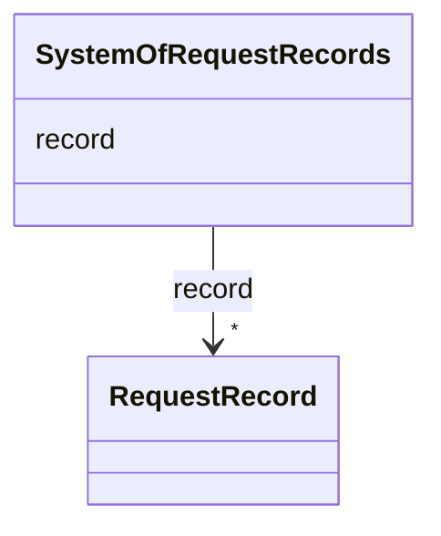

# Class: SystemOfRequestRecords 


URI: [ers:SystemOfRequestRecords](ers:SystemOfRequestRecords)





<!-- no inheritance hierarchy -->


## Slots

| Name | Cardinality and Range | Description | Inheritance |
| ---  | --- | --- | --- |
| [record](record.md) | * <br/> [RequestRecord](RequestRecord.md) |  | direct |


## Identifier and Mapping Information


### Schema Source


* from schema: http://publications.europa.eu/ontology/ers


## Mappings

| Mapping Type | Mapped Value |
| ---  | ---  |
| self | ers:SystemOfRequestRecords |
| native | http://publications.europa.eu/ontology/ers/SystemOfRequestRecords |


## LinkML Source

<!-- TODO: investigate https://stackoverflow.com/questions/37606292/how-to-create-tabbed-code-blocks-in-mkdocs-or-sphinx -->

### Direct

<details>
```yaml
name: SystemOfRequestRecords
from_schema: http://publications.europa.eu/ontology/ers
attributes:
  record:
    name: record
    from_schema: http://publications.europa.eu/ontology/ers
    rank: 1000
    slot_uri: ers:record
    domain_of:
    - SystemOfRequestRecords
    range: RequestRecord
    required: false
    multivalued: true
class_uri: ers:SystemOfRequestRecords

```
</details>

### Induced

<details>
```yaml
name: SystemOfRequestRecords
from_schema: http://publications.europa.eu/ontology/ers
attributes:
  record:
    name: record
    from_schema: http://publications.europa.eu/ontology/ers
    rank: 1000
    slot_uri: ers:record
    alias: record
    owner: SystemOfRequestRecords
    domain_of:
    - SystemOfRequestRecords
    range: RequestRecord
    required: false
    multivalued: true
class_uri: ers:SystemOfRequestRecords

```
</details>